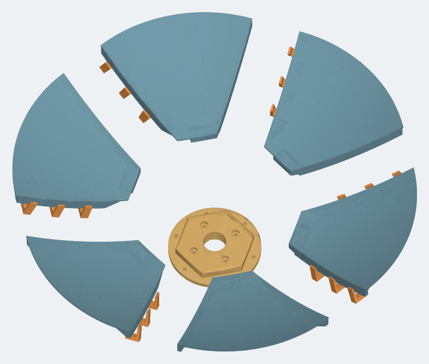
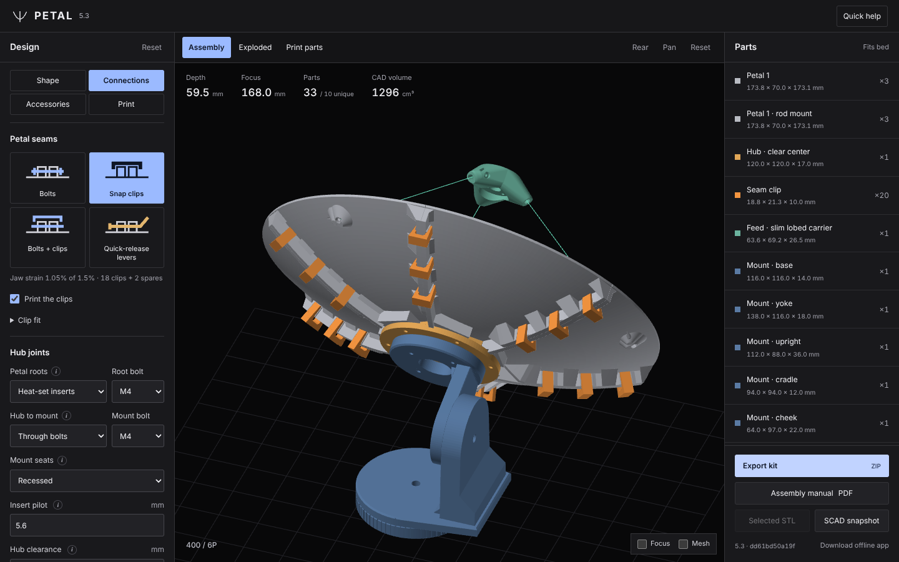
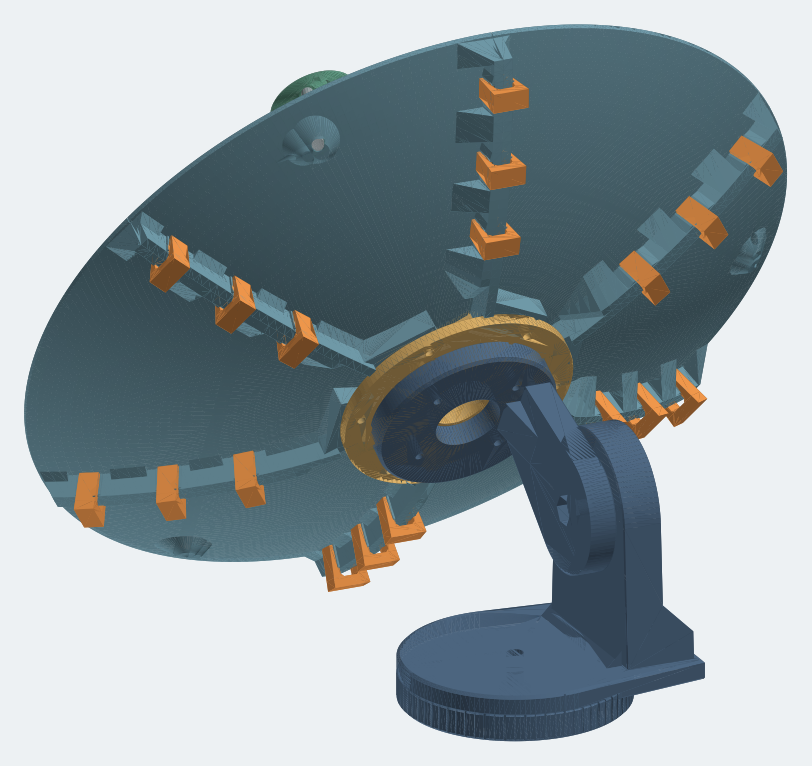
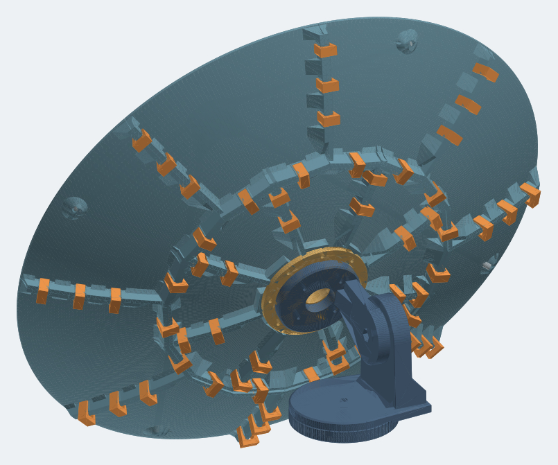
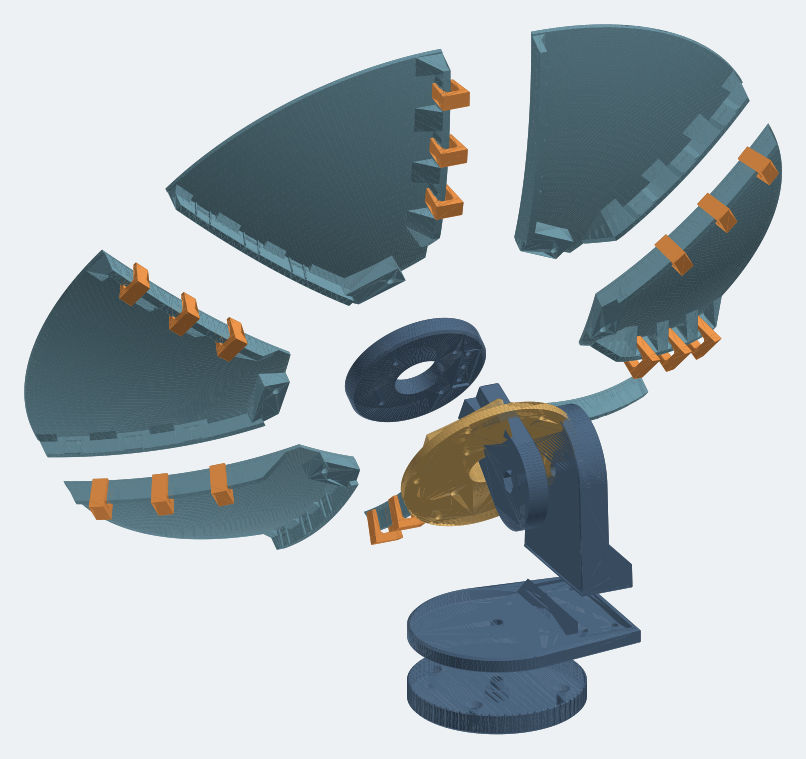
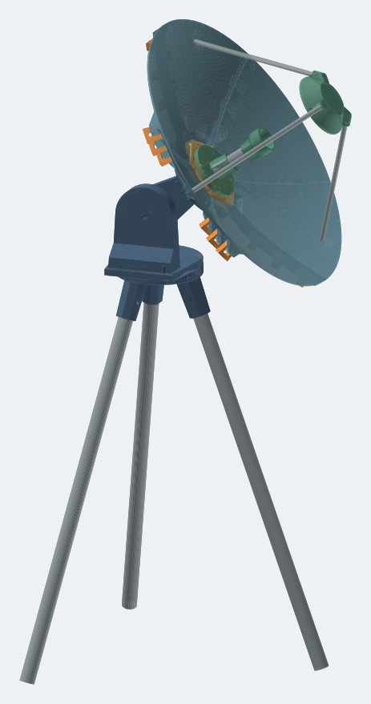

# PETAL — printable parabolic dish generator

PETAL designs a segmented parabolic dish that you can print on an ordinary 3D printer. Enter the dish size and your printer's build volume. It splits the dish into petals that fit your bed and shows the assembly. Then it exports a ready-to-print kit: STLs, packed print plates, an illustrated assembly PDF and a hardware list.

Everything runs in your browser, with no account, no upload and no server-side processing. Geometry builds in a background worker, so the page stays responsive while large dishes generate.



## Get started

Pick one of four ways to run it.

### 1. Open the offline app (no install)

Download **[`dist/petal-5.3-offline.html`](dist/petal-5.3-offline.html)** and open it in a browser. It is a single file with everything built in, and it works without a network connection.

### 2. Self-host on Linux (one command)

```bash
curl -fL https://raw.githubusercontent.com/xattribution/petal-dish/main/scripts/install-linux.sh -o /tmp/petal-install.sh \
  && sudo bash /tmp/petal-install.sh --port 56302 --ref main
```

Then open `http://SERVER-IP:56302`. The installer sets up a small verified web server and a boot-persistent `petal` service.

| Option | Meaning |
|---|---|
| `--port N` | Listen on port N (default 56302) |
| `--ref REF` | Install a branch, tag or full commit SHA (default `main`) |
| `--localhost` | Bind to 127.0.0.1 only, e.g. behind your own reverse proxy |

To update, re-run the same command. For status, logs and rollback, see [docs/SELF-HOSTING.md](docs/SELF-HOSTING.md).

### 3. Docker

```bash
git clone https://github.com/xattribution/petal-dish.git && cd petal-dish
docker compose up -d --build
```

Then open `http://SERVER-IP:56302`. Compose builds an nginx image from the committed `dist/` and publishes port 56302. This serves the static build only. It does not run the verified Linux installer.

To update, run this one line from anywhere. It pulls the latest build, rebuilds the image, restarts the container and removes the old image. Change `~/petal-dish` if you cloned somewhere else.

```bash
git -C ~/petal-dish pull --ff-only && docker compose -f ~/petal-dish/compose.yaml up -d --build && docker image prune -f
```

If Docker needs `sudo` on your server, use this form instead:

```bash
sudo git -C ~/petal-dish pull --ff-only && sudo docker compose -f ~/petal-dish/compose.yaml up -d --build && sudo docker image prune -f
```

Each build loads its script and styles under new URLs, so a normal reload shows the update.

### 4. Run from source

```bash
git clone https://github.com/xattribution/petal-dish.git && cd petal-dish
npm ci
npm run build                      # rebuilds dist/app.bundle.js and the offline file
python3 -m http.server 8080 -d dist  # then open http://localhost:8080
```

## Using it



The editor has four tabs.

1. **Shape:** dish diameter, focal ratio (f/D), shell thickness, an optional frequency, and the hub front.
2. **Connections:** pick the seam method from the four cards, the seam bolt size and the hub joints. **Edit individual joints** changes one seam family or one joint; **Show in model** highlights it.
3. **Accessories:** a prime-focus or Cassegrain rod support and the aiming mount. Each has a checkbox to leave its parts off the print plates when you already have them.
4. **Print:** your printer volume and plate packing. PETAL chooses how many petals and rings are needed, aiming for either the largest petals or the fewest print plates.

Then **Export kit (ZIP)**: every STL in its print orientation, packed plates, `ASSEMBLY.pdf`, `HARDWARE.csv` and the fit-test parts. **Print the two seam test strips first**, then one full petal, before printing the whole dish.

The default 400 mm dish is six petals plus one hub: two unique parts, each with a flat flange down on the bed.

## Options at a glance

| Choice | Options |
|---|---|
| **Seam fastening** | **M3 or M4 bolts** on flat seats (default M3) · **snap clips**, no hardware · **both** (each station takes a bolt or a clip) · **seam levers**, a screwless quick-release cam clamp ([details](docs/SEAM-LEVER.md)) |
| **Petal roots to hub** | Blind heat-set inserts, keeping the reflecting face closed (default) · through bolts, in recessed seats (default) or plain holes. M3, M4 (default) or M5 |
| **Hub to mount** | Through bolts, in recessed seats (default) or plain holes · blind inserts. Four M3, M4 (default) or M5 on a 60 mm bolt circle around a clear Ø30 mm center |
| **Hub clearance** | 0 mm (default) to 0.6 mm of extra gap at the hub's edges and root holes, so the petals line up on their seams before the root bolts clamp them to the hub. The mount holes stay put |
| **Hub front** | Flat (default): level with the petals at the hub's corners and chamfered down to them along each edge, so it prints cleanly · curved, following the dish |
| **Underside** | Smooth curved shell (default) · small flat facets |
| **Automatic sizing** | Largest petals: the fewest pieces and seams (default) · fewest print plates: may use more, smaller petals when they pack onto fewer beds |
| **Large dishes** | Staggered rings (default) · aligned rings |
| **Feed support** | None · prime focus · Cassegrain secondary (experimental) · Gregorian collector: a bowl over the focus that folds the signal down to your insert, re-solved for every dish shape ([details](docs/FEED-OPTICS.md#gregorian-collector)). All on 3 or 4 aluminum rods with generated cut lengths |
| **Aiming mount** | None · printed manual alt-az mount, split into parts joined with heat-set inserts. Optional elevation arc lock. Base: printed with an azimuth scale, tripod leg sockets for your own legs, or none (bolt the turntable to a stand). Bolt sizes: clamps M6, M8 (default) or M10; joint screws M3–M5; stand screws M4–M6; leg cross bolts by leg size or M3–M6. The clamp bolt heads, the azimuth nut and the no-base stand screws sit in pockets or countersinks (default) or on plain holes ([details](docs/SIMPLE-MOUNT.md)) |

All seam hardware stays behind the reflecting face.

| Rear: clips, hub and mount | 600 mm, two staggered rings | Exploded |
|---|---|---|
|  |  |  |

| Gregorian collector on the tripod base | Tripod leg sockets |
|---|---|
|  |  |

Seams take M3 or M4. Petal roots and hub mounts take M3, M4 or M5; M4 is the default interface. Kits with joint overrides include `CONNECTIONS.csv` and individually named petal variants. Help for each setting is in its **ⓘ** tooltip, and the full print and assembly instructions are in the generated PDF.

Viewport: drag to orbit, **middle drag / Shift drag** to pan, wheel to zoom toward the cursor, or use **Pan** mode. On touchscreens, use two fingers to pan and pinch. Shift + arrows pan; Home resets the camera.

Feed revision 7 uses a small rounded taper around each direct petal rod hole and a compact side-screw ear. The large underside pyramid, separate rim shoes, backing plates and paired mounting bolts are gone. Only the bore changes angle as dish size or focal distance changes; the exterior blends into the dish underside. The circular bearing has 45° roof shoulders and a **0.8 mm bridge** for the exported side-print orientation.

In **Accessories → Feed support**, choose **Enter diameter**, then enter your measured rod diameter in **mm or inches** (2–12.7 mm / approximately 0.079–0.5 inches). For example, 0.25 inches is exactly 6.35 mm. Both petal and carrier bores use this diameter plus the selected diametral clearance. Switching units preserves physical size. **Auto** still screens the available 4, 5, 6, 6.35 and 8 mm stock sizes. Exported geometry, manifest and rod schedule use millimeters; the CSV also includes cut lengths in inches.

Petal retention uses an **M3 × 12 headless screw** and a **short M3 heat-set insert**, maximum 4 mm long, compatible with a 4.2 mm pilot. Carrier hex nuts remain unchanged. Regenerate mounting petals, carrier and rod cuts together; previous feed revisions are not interchangeable. Test one mounting petal for your rod and insert fit first. The carrier and secondary still need their own slicer support review.


## Documentation

- [ASSEMBLY / print notes](docs/DEFAULT-ASSEMBLY.md): the generated instructions for the default dish. Your kit includes a version for your exact settings.
- [Test article procedure](docs/TEST_ARTICLE.md): what to print and measure first.
- [Reflective surface](docs/REFLECTOR.md): foil tape and conductive coatings.
- [Feed optics and rod supports](docs/FEED-OPTICS.md)
- [Aiming mount](docs/SIMPLE-MOUNT.md) · [Seam lever](docs/SEAM-LEVER.md)
- [Engineering limits](docs/ENGINEERING.md) · [Validation record](docs/VALIDATION.md)
- [Self-hosting](docs/SELF-HOSTING.md)

## Status and limits

PETAL is an **engineering prototype**. Test prints fit as designed, but a closed STL is not a load, weather or RF rating. Printed plastic needs a conductive finish and a proper RF feed before it works as an antenna. Interface revision 12 parts are not compatible with older kits, so regenerate the whole kit after changing settings. PETG is fine for indoor fit tests. Use ASA for outdoor trials, with a controlled enclosure.

## Develop

```bash
npm ci
npm test              # geometry, feed, plates, rings, integration
npm run test:ui       # builds, then drives the offline app in jsdom
npm run test:scad     # snapshot renders vs. JS geometry (needs OpenSCAD)
npm run test:pdf      # manual PDF fixtures (needs Python)
npm run test:hosting  # real Caddy check of the installer config (downloads Caddy once)
npm run build         # dist/app.bundle.js, petal-5.3-offline.html, BUILD.json
```

The app sources live in `dist/`:

- `app.js`, `workspace-ui.js`, `viewer.js`: the page, its controls and the WebGL preview
- `engine.js`: the geometry worker (build and every export); `engine-client.js` starts it, or runs it on the page if workers are unavailable
- `params.js`: defaults, limits and validation, shared by the page and the worker
- `geometry.js`: dish, flanges, hub and seam fasteners
- `mount.js`: the aiming mount
- `feed.js`: optics and feed supports
- `exports.js`, `zip.js`: kit, guide, manifest and the deflated ZIP
- `manual.js`: the PDF

The printed accessories are OpenSCAD sources in `cad/`. After editing them, regenerate the bundled meshes:

- `python3 scripts/pack-mount.py` for the mount
- `python3 scripts/pack-lever.py` for the seam lever (needs OpenSCAD and `trimesh`)

`app.bundle.js` and the offline HTML are reproducible build outputs. `npm run docs` regenerates the default guides in `docs/`, and `node scripts/render-system.mjs && python3 scripts/render-system.py && node scripts/render-app.mjs` regenerates the README images. Earlier designs remain in git history.
