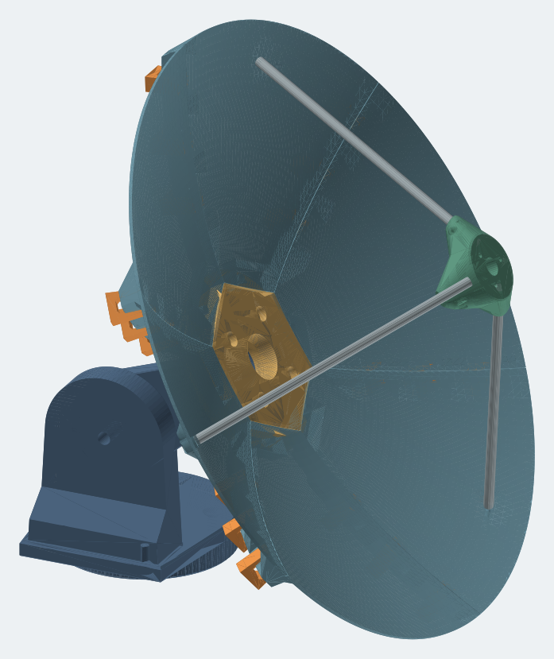

# PETAL — printable parabolic dish generator

PETAL designs a segmented parabolic dish that you can print on an ordinary 3D printer. Enter the dish size and your printer's build volume. It splits the dish into petals that fit your bed and shows the assembly. Then it exports a ready-to-print kit: STLs, packed print plates, an illustrated assembly PDF and a hardware list.

Everything runs in your browser, with no account, no upload and no server-side processing.



## Get started

Pick one of three ways to run it.

### 1. Open the offline app (no install)

Download **[`dist/petal-5.3-offline.html`](dist/petal-5.3-offline.html)** and open it in a browser. It is a single file with everything built in, and it works without a network connection.

### 2. Self-host on Linux (one command)

```bash
curl -fL https://raw.githubusercontent.com/xattribution/petal-dish/main/scripts/install-linux.sh -o /tmp/petal-install.sh \
  && sudo bash /tmp/petal-install.sh --port 56302 --ref main
```

Then open `http://SERVER-IP:56302`. The installer sets up a small verified web server and a boot-persistent `petal` service.

| Option | Meaning |
|---|---|
| `--port N` | Listen on port N (default 56302) |
| `--ref REF` | Install a branch, tag or full commit SHA (default `main`) |
| `--localhost` | Bind to 127.0.0.1 only, e.g. behind your own reverse proxy |

To update, re-run the same command. For status, logs and rollback, see [docs/SELF-HOSTING.md](docs/SELF-HOSTING.md).

### 3. Run from source

```bash
git clone https://github.com/xattribution/petal-dish.git && cd petal-dish
npm ci
npm run build                      # rebuilds dist/app.bundle.js and the offline file
python3 -m http.server 8080 -d dist  # then open http://localhost:8080
```

## Using it

1. **Shape:** set the dish diameter, the focal ratio (f/D) and, optionally, the frequency.
2. **Printer:** pick your build volume. PETAL chooses how many petals and rings are needed.
3. **Joints:** pick how the seams fasten and how the petals attach to the hub (options below).
4. **Extras:** optionally add a feed or secondary-reflector support, and the aiming mount.
5. **Export kit (ZIP):** this gives you every STL in its print orientation, packed plates, `ASSEMBLY.pdf`, `HARDWARE.csv` and the fit-test parts.
6. **Print the two seam test strips first**, then one full petal, before printing the whole dish.

The default 400 mm dish is six petals plus one hub: two unique parts, each with a flat flange down on the bed.

## Options at a glance

| Choice | Options |
|---|---|
| **Seam fastening** | **M3 or M4 bolts** on flat seats (default M3) · **snap clips**, no hardware · **both** (each station takes a bolt or a clip) · **seam levers**, a screwless quick-release cam clamp ([details](docs/SEAM-LEVER.md)) |
| **Petal roots to hub** | Blind M4 heat-set inserts, keeping the reflecting face closed (default) · M4 through bolts in recessed seats |
| **Hub to mount** | M4 through bolts (default) · blind M4 inserts. Four on a 60 mm bolt circle around a clear Ø30 mm center |
| **Hub front** | Curved, following the dish (default) · flat |
| **Underside** | Smooth curved shell (default) · small flat facets |
| **Large dishes** | Staggered rings (default) · aligned rings |
| **Feed support** | None · prime focus · Cassegrain secondary (experimental), on 3 or 4 aluminum rods with generated cut lengths |
| **Aiming mount** | None · printed manual alt-az mount, split into parts joined with heat-set inserts. Optional elevation arc lock, and an optional printed base (or bolt the turntable straight to a stand) ([details](docs/SIMPLE-MOUNT.md)) |

All seam hardware stays behind the reflecting face.

The editor has **Shape, Connections, Accessories and Print** categories. Open the Connections drawer to choose a default, override petal seams or ring seams, or change one joint. **Show joint in model** highlights the matching pieces. Seams support M3/M4; petal roots and hub mounts use the fixed M4 interface. Kits with overrides include `CONNECTIONS.csv` and individually named petal variants.

Accessories can stay visible in the assembly while being excluded from print plates and STL exports when you already have matching parts. Full print and assembly details are in the generated PDF; Quick help stays brief.

Viewport: drag to orbit, **middle drag / Shift drag** to pan, wheel to zoom toward the cursor, or use **Pan** mode. On touchscreens, use two fingers to pan and pinch. Shift + arrows pan; Home resets the camera.

Feed revision 6 fastens rods directly into the mounting petals with integrated underside through-bores and side screws. The new petal sockets use print-aligned 45° ramps and roofs at 45° or steeper; separate rim shoes and their mounting bolts are removed. Regenerate mount petals, carrier and rod cuts together.

## Documentation

- [ASSEMBLY / print notes](docs/DEFAULT-ASSEMBLY.md): the generated instructions for the default dish. Your kit includes a version for your exact settings.
- [Test article procedure](docs/TEST_ARTICLE.md): what to print and measure first.
- [Reflective surface](docs/REFLECTOR.md): foil tape and conductive coatings.
- [Feed optics and rod supports](docs/FEED-OPTICS.md)
- [Aiming mount](docs/SIMPLE-MOUNT.md) · [Seam lever](docs/SEAM-LEVER.md)
- [Engineering limits](docs/ENGINEERING.md) · [Validation record](docs/VALIDATION.md)
- [Self-hosting](docs/SELF-HOSTING.md)

## Status and limits

PETAL is an **engineering prototype that has not been printed or tested**. A closed STL is not a load, weather or RF rating. Printed plastic needs a conductive finish and a proper RF feed before it works as an antenna. Interface revision 12 parts are not compatible with older kits, so regenerate the whole kit after changing settings. PETG is fine for indoor fit tests. Use ASA for outdoor trials, with a controlled enclosure.

## Develop

```bash
npm ci
npm test              # geometry, feed, plates, rings, integration
npm run test:ui       # builds, then drives the offline app in jsdom
npm run test:scad     # snapshot renders vs. JS geometry (needs OpenSCAD)
npm run test:pdf      # manual PDF fixtures (needs Python)
npm run build         # dist/app.bundle.js, petal-5.3-offline.html, BUILD.json
```

The app sources live in `dist/`:

- `geometry.js`: dish, flanges, hub and seam fasteners
- `mount.js`: the aiming mount
- `feed.js`: optics and feed supports
- `exports.js`: kit, guide and manifest
- `manual.js`: the PDF

The printed accessories are OpenSCAD sources in `cad/`. After editing them, regenerate the bundled meshes:

- `python3 scripts/pack-mount.py` for the mount
- `python3 scripts/pack-lever.py` for the seam lever (needs OpenSCAD and `trimesh`)

`app.bundle.js` and the offline HTML are reproducible build outputs. Earlier designs remain in git history.
