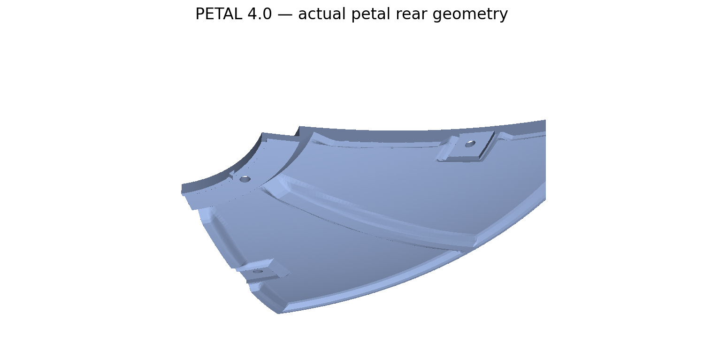

# PETAL 4.0 engineering record

## Scope and status

Revision 9 addresses repeatable geometric seating, continuous shell thickness, section depth, hub bearing material and supported printing. It does not supply a complete RF feed/mount system or a structural load rating. A physical test article is still required. The first validation target is the default 400 mm assembly, not the entire 180–1200 mm parameter envelope as a qualified product family.

## Joining strategy

Continuous male/female tongues around all petal boundaries were considered and rejected for this pass. Closed-loop insertion can trap the final petal, and tight keys can turn anisotropic shrinkage into forced distortion. Removable rear locating plates preserve the ability to align a complete ring before clamping.

The former 1 mm recessed interface had a nominal 0.2 mm axial gap. Revision 9 uses 2 mm-deep seats and matching tangent-plane bearing surfaces in curved-shell mode. A plate can seat against its intended datum without bending the panel to close that nominal gap. Actual triangle-mesh mating is tested rather than relying only on analytic surface equations. Faceted backs retain 0.05 mm relief and remain a secondary construction option.

The seam-normal perimeter controls lateral location. Same-ring seats include an additional 0.30 mm radial relief per side. This reduces redundant radial constraint, but does not give unlimited adjustment: round M4 clearance bores and the root registration also constrain motion. Nut clearance is now independent of seat/root clearance. This is a clearance-fit assembly, not a fully kinematic mount and not a mechanism for correcting warped parts.

No snap retention is claimed. Hex pockets prevent rotation; removable tape holds nuts while starting screws. A warped full petal must be corrected at the print process, not pulled into position with bolt torque.

## Permanent structure and mass

The recommended construction retains the selected field thickness and adds ribs behind the reflector. Ribs have up to 4 mm depth, a 6 mm crown, and cosine shoulders extending another 4 mm per side. Boundaries and the radial centerline are reinforced. Rib depth fades near the root and clears the locating seats/fasteners. All reinforcement is behind the reference parabola.

The hub bottom is 2 mm thicker than revision 8. This increases bearing-section material; it does not establish allowable mount moment. The same 120 mm hub / 60 mm bolt circle must not be assumed equally suitable for every diameter. Mount adapter, feed support and long-term clamp-load management remain separate engineering work.

Measured solid CAD volumes, excluding supports and hardware:

| Default dish | Revision 8 | Revision 9 | Revision-9 segmentation |
|---|---:|---:|---|
| 400 mm | 449.95 cm³ | 604.57 cm³ | 6 petals × 1 ring |
| 800 mm | 1,358.16 cm³ | 2,081.38 cm³ | 14 petals × 2 rings |

Revision-8 reference: commit `8bdb676d872a52d17e5bc47e46417b6b05d68ead`, round-hole hardware, curved shell, no perforations. Revision-9 defaults add structure and prefer lower print angles; the 800 mm comparison also includes a segmentation change from 10 to 14 petals per ring. These are **mass penalties of approximately 34% and 53%**, not weight savings. The intended benefit is shape retention, which must be measured.

A section-property check on the default 400 mm petal, at local x = 150 mm, integrates its rear thickness across the width in 0.1 mm strips. With the front curvature mathematically straightened, section area increases from 316.79 to 497.30 mm²; centroidal second moment increases from 93.65 to 948.28 mm⁴. This checks that material is being placed at section depth efficiently at that particular cut. It is **not** an FEA result, whole-dish stiffness ratio, buckling calculation, or allowance for FDM anisotropy and joint compliance. It must not be marketed as a tenfold stronger dish.

## Print orientation and supports

Automatic orientation tries 45° before steeper angles, and segmentation cost penalizes angles above 45°. This reduces height and avoids always accepting the minimum-part-count tall print. It can increase part count, seams and material. Manual angles remain available. The scoring does not model actual slicer time, thermal stress, cooling, adhesion or layer-direction strength.

Default 400 mm nominal angle changes from 60° to 45°. Its exported petal is about 134.5 mm tall including supports. Default 800 mm petals use 45° in both rings instead of the earlier 60°; this requires additional segmentation.

The initial solid-web supports consumed approximately 185.34 cm³ for the revision-9 400 mm kit. Windowed supports reduce this to approximately 102.48 cm³, about 45% less support CAD volume, while preserving continuous feet and contact ridges. Pillars are 4 mm wide on 12 mm centers; support openings span at most 8 mm. Slicer bridge behavior still needs inspection.

Support clearance uses triangle clipping across the entire web width, rather than five sampled slices. A narrow feature missed between slices was detected by broader testing and motivated this change. The resulting support profile is conservatively simplified with a 0.005 mm allowance, avoiding a large mesh-size penalty. Testing samples actual upward-facing support triangles and the actual petal underside, independent of support vertex numbering.

## Hardware and assembly

All three modes remain. Front hex pockets have deeper floors to provide practical screw-tip allowance. Blind inserts remain an 8.1 mm M4 reference; geometry does not imply interchangeability with every M4 insert. Installation is referenced to the blind roof with a 1 mm reserve, rather than forcing the insert flush with a sloped mouth. The schedule reports rear-mouth recess depth and screw engagement.

HARDWARE.csv gives per-position radii/azimuths, quantities, nominal stock lengths, washer allowance, minimum engagement length and maximum permitted length. Nominal nut-engagement allowance is 0.2 mm; insert-engagement allowance is 0.4 mm. Custom-length flags remain possible outside the default configuration. The four mounting lengths are deliberately unresolved until the external adapter is specified. For original front-screw mounting, the adapter needs external rear nuts/washers; nuts trapped ahead of it do not clamp it.

Inserts and extra plastic do not solve creep of a compressed polymer stack. A long-term outdoor mount needs validated clamp loads and possibly metal backing/compression limiters. Generic M4 steel-joint torque values are inappropriate here. No torque value is claimed.

## User guidance and export integrity

The app's Print notes and exported assembly guide share one generator, including hardware-mode branches and the nominal screw purchase list. REFLECTOR.md distinguishes a plastic support from a conductive RF surface and covers conductive-adhesive foil, specified conductive paints, masking, seam bridging, adhesion, continuity and feed alignment. INSPECTION.csv provides nominal radial heights. TEST_ARTICLE.md defines staged physical checks.

All current SCAD exports are exact mesh snapshots. The old parametric kernel is explicitly archived as revision 7. OpenSCAD comparisons verify export integrity, not independent mechanical or RF correctness.

## Verification and remaining work

Automated checks cover closed topology, face winding, print bounds, actual mating meshes, hardware clearance/skins, root capture, bore mapping, full-width support clearance, coupons, packing quantities, screw windows and mode-specific instructions. Representative OpenSCAD renders are compared for volume and dimensions. A DOM-level test exercises startup, all fastening modes, independent clearances, packing, reset and the shared instructions; it does not validate WebGL rendering or visual browser layout.

Unresolved physical questions: full-petal warping, support removal and bridge quality, cyclic assembly wear, clamping deformation, creep, insert installation/pullout, global shape under gravity and wind, mount/adapter loads, coating durability and RF performance. Follow TEST_ARTICLE.md before reducing material or treating the design as field-qualified.
