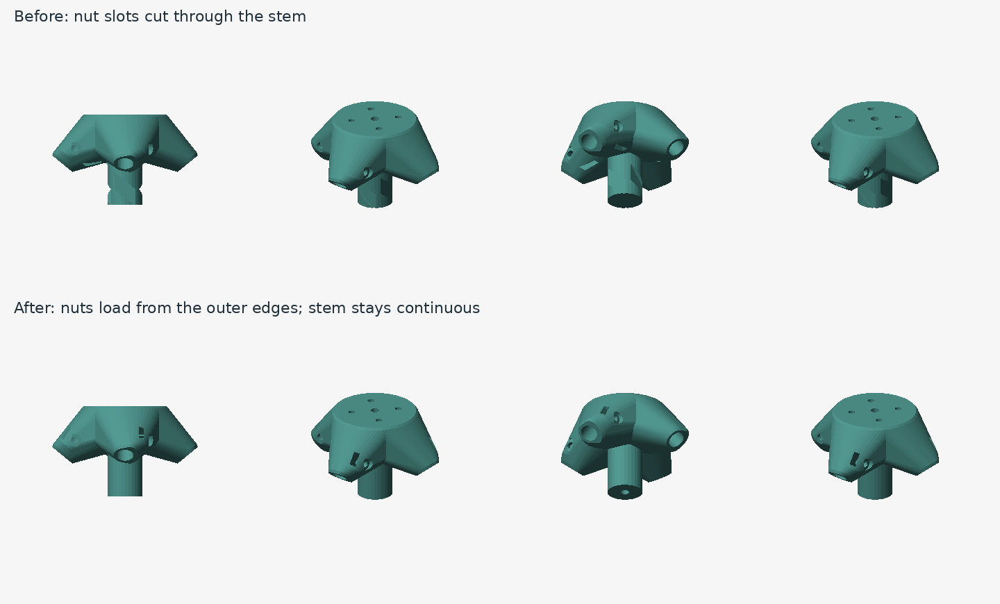

# Feed geometry review — build ecdc20b6aff8

The multi-view review found two defects that the previous clearance checks missed:

1. At steep secondary-support angles, inward nut-loading slots crossed the central stem, leaving visible notches. Carrier nuts now load inward from the outer socket edges; the channels extend outward/upward away from the stem. Independent checks still verify the complete real-nut insertion path.
2. The M4 clearance bore ended 20 mm below the carrier face while the stem was at least 30 mm tall. The remaining solid floor blocked the screw. The bore now starts below the actual secondary back datum and passes through the full stem at any generated height.




## Visual coverage

Reviewed top, side, end, front oblique, underside and rear oblique views of the rim fitting, carrier and fitting/petal interface for all 40 supported sampled configurations: **720 views**. Size/focal-ratio cases cover 260–1200 mm dishes and f/D 0.25–0.8. Extra cases exercise 1.51° and 78.39° rod angles, 4/8 mm rods, clearance extremes, phase offsets and a longer manually positioned secondary stem. The orbit adds 24 azimuths, alternating above and below, for four representative configurations. These are samples, not a guarantee for every continuous parameter combination.

The thin rim feet, chamfered mounting reinforcement and socket-to-carrier envelopes retain consistent silhouettes in the sampled views. The intentional washer recesses, nut-entry channels, underside perimeter relief and CAD tessellation facets remain visible. A per-pixel depth buffer handles occlusion; the review does not use smoothed normals to hide the actual mesh. Petal-interface images deliberately crop the surrounding petal for close inspection.

## Validation

The expanded 57-case sweep builds 40 and explicitly rejects 17 at existing geometry/stock limits. Independent checks pass connected/watertight meshes, reflector/rod/secondary clearance, washer/nut seating, nut-loading paths, continuous secondary stem walls and the full M4 screw passage. All 80 fitting print meshes retain flat bed contact. Feed/integration tests, the embedded UI DOM checks, OpenSCAD parity including both carriers, and custom/secondary PDF checks pass. Slicer and physical-fit checks remain separate.

Reproduce the review with:

```sh
node scripts/check-feed-envelope.mjs
python3 scripts/check-feed-envelope.py
python3 scripts/render-feed-review.py
python3 scripts/render-feed-review.py --turntable edge-4 400-0.42-1 edge-2 edge-3
```

Individual sheets are written to `tmp/feed-review`. The renderer requires NumPy and Pillow; independent geometry checks additionally require trimesh and manifold3d.

## Inspected configurations

| Case | Dish mm | f/D | Rods | Rod diameter mm | Rod angle ° |
| --- | --- | --- | --- | --- | --- |
| 260-0.25-2 | 260 | 0.25 | 3 | 4 | 21.49 |
| 260-0.3-1 | 260 | 0.3 | 3 | 4 | 18.37 |
| 260-0.42-1 | 260 | 0.42 | 3 | 4 | 37.57 |
| 260-0.6-1 | 260 | 0.6 | 3 | 4 | 53.04 |
| 260-0.8-1 | 260 | 0.8 | 3 | 4 | 62.24 |
| 400-0.25-2 | 400 | 0.25 | 3 | 6.35 | 11.12 |
| 400-0.3-1 | 400 | 0.3 | 3 | 6.35 | 15.21 |
| 400-0.3-2 | 400 | 0.3 | 3 | 6.35 | 20.78 |
| 400-0.42-1 | 400 | 0.42 | 3 | 6.35 | 34.10 |
| 400-0.42-2 | 400 | 0.42 | 3 | 6.35 | 36.28 |
| 400-0.6-1 | 400 | 0.6 | 3 | 6.35 | 49.99 |
| 400-0.6-2 | 400 | 0.6 | 3 | 6.35 | 50.24 |
| 400-0.8-1 | 400 | 0.8 | 3 | 6.35 | 59.73 |
| 400-0.8-2 | 400 | 0.8 | 3 | 6.35 | 59.51 |
| 600-0.25-2 | 600 | 0.25 | 4 | 6.35 | 5.21 |
| 600-0.3-1 | 600 | 0.3 | 4 | 6.35 | 13.47 |
| 600-0.3-2 | 600 | 0.3 | 4 | 6.35 | 14.98 |
| 600-0.42-1 | 600 | 0.42 | 4 | 6.35 | 32.11 |
| 600-0.42-2 | 600 | 0.42 | 4 | 6.35 | 32.81 |
| 600-0.6-1 | 600 | 0.6 | 4 | 6.35 | 48.18 |
| 600-0.6-2 | 600 | 0.6 | 4 | 6.35 | 48.20 |
| 600-0.8-1 | 600 | 0.8 | 4 | 6.35 | 58.22 |
| 600-0.8-2 | 600 | 0.8 | 4 | 6.35 | 58.14 |
| 800-0.25-2 | 800 | 0.25 | 3 | 8 | 3.97 |
| 800-0.3-1 | 800 | 0.3 | 3 | 8 | 12.65 |
| 800-0.3-2 | 800 | 0.3 | 3 | 8 | 14.38 |
| 800-0.42-1 | 800 | 0.42 | 3 | 8 | 31.16 |
| 800-0.42-2 | 800 | 0.42 | 3 | 8 | 31.67 |
| 800-0.6-1 | 800 | 0.6 | 3 | 8 | 47.30 |
| 800-0.6-2 | 800 | 0.6 | 3 | 8 | 47.56 |
| 1200-0.25-2 | 1200 | 0.25 | 4 | 6.35 | 2.29 |
| 1200-0.3-1 | 1200 | 0.3 | 4 | 6.35 | 11.87 |
| 1200-0.3-2 | 1200 | 0.3 | 4 | 6.35 | 12.85 |
| edge-0 | 400 | 0.3 | 4 | 8 | 15.21 |
| edge-1 | 400 | 0.8 | 3 | 4 | 48.46 |
| edge-2 | 400 | 0.6 | 4 | 8 | 50.85 |
| edge-3 | 260 | 0.8 | 3 | 8 | 78.39 |
| edge-4 | 1200 | 0.3 | 4 | 8 | 1.51 |
| edge-5 | 260 | 0.8 | 3 | 4 | 78.39 |
| edge-6 | 400 | 0.8 | 3 | 8 | 59.48 |
