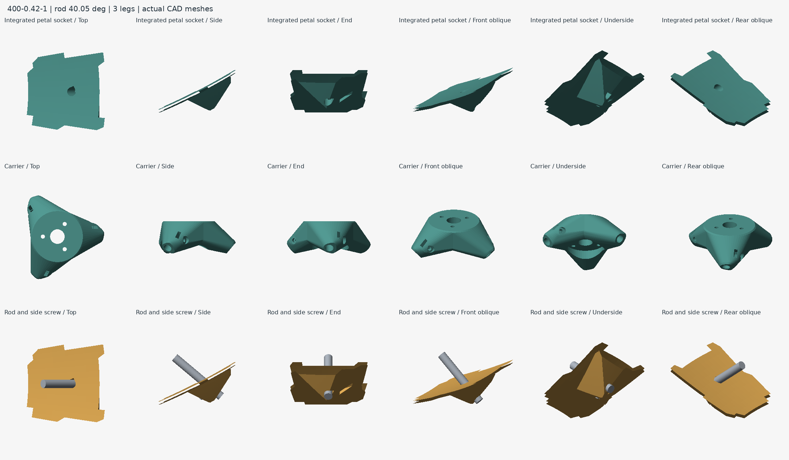
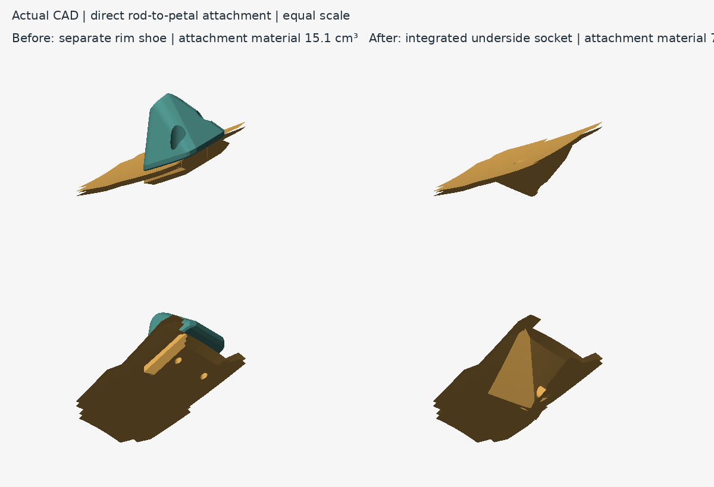
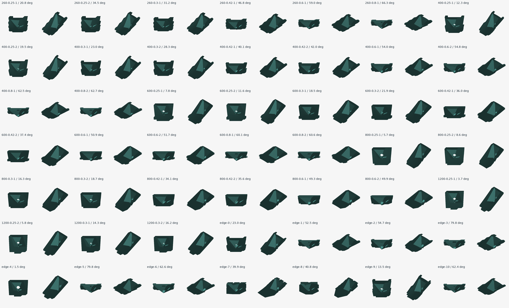
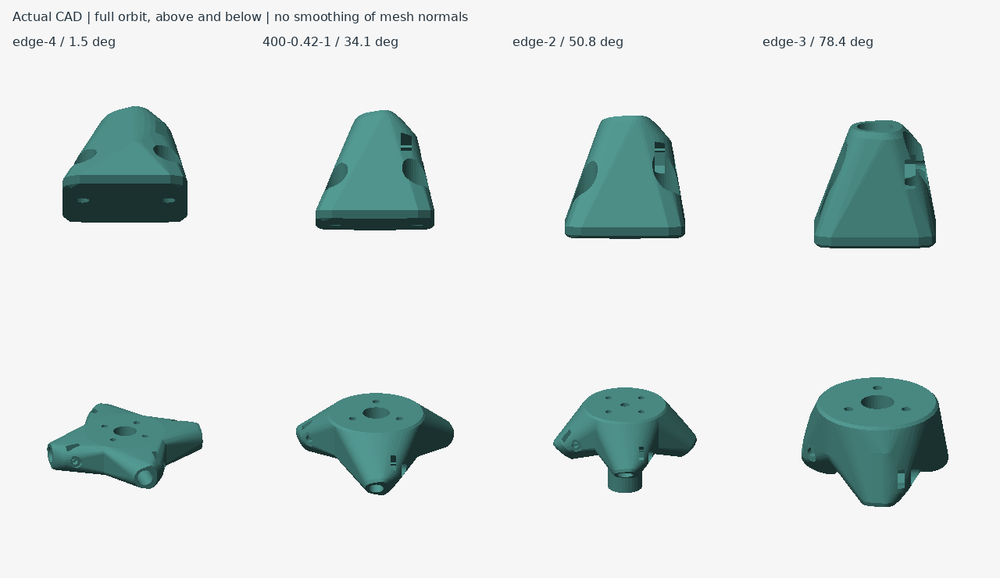

# Direct petal rod attachment review — build 40809f9125e7

Feed attachment revision 6 removes the separate rim shoe, rear pad interface and two mounting bolts per rod. A through-bore and underside side screw fasten the rod directly to the petal. The small saddle grows continuously from the shell, stays inside the dish rim and has chamfers around its underside.





The default attachment uses approximately **51% less printed material** than the former mounting reinforcement plus separate shoe. This compares added attachment material only, excluding the common petal shell and flanges.

## Support-free geometry

The new attachment follows the petal's existing side-print direction, not world Z or the rod axis. Its underside ramps and rod-hole roof are 45°; the small screw-hole roof is 50° to give margin at boolean intersections. The square-nut slot opens through the underside and is clipped below the shell, preserving the reflector face outside the intentional rod hole.

All 49 sampled integrated sockets have **zero flagged surface area beyond the 45° overhang criterion**, with a 0.0001 normal-component tolerance for numeric noise. Real rods, square nuts and side screw access clear the generated geometry. Material witnesses verify both nut-bearing walls; square nuts can travel through their complete insertion path. Every exported component remains connected, watertight and consistently wound.

This checks support-free geometry for the **new petal attachment**. The existing carrier's circular bores and hex-nut roofs, and the secondary shell, still require separate slicer support review. These mesh checks are not a physical print, slip/creep test or load rating for PCTG/ASA.

## Coverage and consistency

The 61-case sweep builds 49 and rejects 12 at the optical/stock envelope limits. It covers 260–1200 mm dishes, f/D 0.25–0.8, 3/4 rods, 4–8 mm stock, clearance extremes, phase offsets, 1.6/6 mm shells and faceted backs. Rod elevations range from 1.54° to 79.77°.

Six orthographic views per case show the integrated petal, carrier and actual rod/screw assembly: 882 renders. The contact sheet compares all sampled sockets from the end and underside; the orbit covers four representative cases from above and below. Cropped petal edges in close-ups are inspection boundaries, not exported geometry.

[Steep-angle close-up](feed-direct-steep.png) · [Small deep dish](feed-direct-small.png) · [Large shallow dish](feed-direct-shallow.png) · [Secondary support](feed-direct-secondary.png)





The lower rod datum is under the reflector, and the front crossing is solved from the parabola. Rod CSVs now distinguish insertion marks from continuous bearing length and report the actual rod-end heights. Hardware lists distinguish petal square nuts from carrier hex nuts and remove shoe bolts/washers. Revision 5 rods and mount petals do not interchange; regenerate the matching kit.

Carrier geometry is built near the origin before adding its assembled height, avoiding Float32 loft precision loss at large phase offsets. The previous secondary-stem safeguards remain checked: an unbroken stem wall and an M4 screw passage through its full height.

Validation includes the general test suite, feed topology/cut/export tests, embedded UI DOM checks, OpenSCAD volume/bounds parity, illustrated PDF content/layout and static-host asset checks. WebGL and physical printing are outside those automated checks.

## Reproduce

```sh
node scripts/check-feed-envelope.mjs
python3 scripts/check-feed-envelope.py
python3 scripts/render-feed-review.py
python3 scripts/render-feed-review.py --matrix
python3 scripts/render-feed-review.py --turntable 400-0.42-1 260-0.25-1 1200-0.25-1 800-0.6-2
```

Python review dependencies: NumPy, Pillow, trimesh and manifold3d. Individual sheets are written to `tmp/feed-review`.

## Sampled configurations

| Case | Dish mm | f/D | Mode | Rod elevation ° |
| --- | --- | --- | --- | --- |
| 260-0.25-1 | 260 | 0.25 | 1 | 20.75 |
| 260-0.25-2 | 260 | 0.25 | 2 | 34.47 |
| 260-0.3-1 | 260 | 0.3 | 1 | 31.15 |
| 260-0.42-1 | 260 | 0.42 | 1 | 46.78 |
| 260-0.6-1 | 260 | 0.6 | 1 | 58.98 |
| 260-0.8-1 | 260 | 0.8 | 1 | 66.33 |
| 400-0.25-1 | 400 | 0.25 | 1 | 12.33 |
| 400-0.25-2 | 400 | 0.25 | 2 | 19.51 |
| 400-0.3-1 | 400 | 0.3 | 1 | 23.04 |
| 400-0.3-2 | 400 | 0.3 | 2 | 28.32 |
| 400-0.42-1 | 400 | 0.42 | 1 | 40.05 |
| 400-0.42-2 | 400 | 0.42 | 2 | 42.02 |
| 400-0.6-1 | 400 | 0.6 | 1 | 53.96 |
| 400-0.6-2 | 400 | 0.6 | 2 | 54.78 |
| 400-0.8-1 | 400 | 0.8 | 1 | 62.49 |
| 400-0.8-2 | 400 | 0.8 | 2 | 62.67 |
| 600-0.25-1 | 600 | 0.25 | 1 | 7.77 |
| 600-0.25-2 | 600 | 0.25 | 2 | 11.59 |
| 600-0.3-1 | 600 | 0.3 | 1 | 18.47 |
| 600-0.3-2 | 600 | 0.3 | 2 | 21.86 |
| 600-0.42-1 | 600 | 0.42 | 1 | 36.04 |
| 600-0.42-2 | 600 | 0.42 | 2 | 37.39 |
| 600-0.6-1 | 600 | 0.6 | 1 | 50.86 |
| 600-0.6-2 | 600 | 0.6 | 2 | 51.73 |
| 600-0.8-1 | 600 | 0.8 | 1 | 60.10 |
| 600-0.8-2 | 600 | 0.8 | 2 | 60.56 |
| 800-0.25-1 | 800 | 0.25 | 1 | 5.66 |
| 800-0.25-2 | 800 | 0.25 | 2 | 8.62 |
| 800-0.3-1 | 800 | 0.3 | 1 | 16.32 |
| 800-0.3-2 | 800 | 0.3 | 2 | 18.74 |
| 800-0.42-1 | 800 | 0.42 | 1 | 34.09 |
| 800-0.42-2 | 800 | 0.42 | 2 | 35.63 |
| 800-0.6-1 | 800 | 0.6 | 1 | 49.32 |
| 800-0.6-2 | 800 | 0.6 | 2 | 49.89 |
| 1200-0.25-1 | 1200 | 0.25 | 1 | 3.67 |
| 1200-0.25-2 | 1200 | 0.25 | 2 | 5.80 |
| 1200-0.3-1 | 1200 | 0.3 | 1 | 14.26 |
| 1200-0.3-2 | 1200 | 0.3 | 2 | 16.17 |
| edge-0 | 400 | 0.3 | 1 | 23.04 |
| edge-1 | 400 | 0.8 | 1 | 52.50 |
| edge-2 | 400 | 0.6 | 2 | 54.72 |
| edge-3 | 260 | 0.8 | 1 | 79.77 |
| edge-4 | 1200 | 0.3 | 1 | 1.54 |
| edge-5 | 260 | 0.8 | 1 | 79.77 |
| edge-6 | 400 | 0.8 | 2 | 62.64 |
| edge-7 | 400 | 0.42 | 1 | 39.89 |
| edge-8 | 400 | 0.42 | 1 | 40.79 |
| edge-9 | 400 | 0.25 | 1 | 13.54 |
| edge-10 | 400 | 0.8 | 1 | 62.43 |
