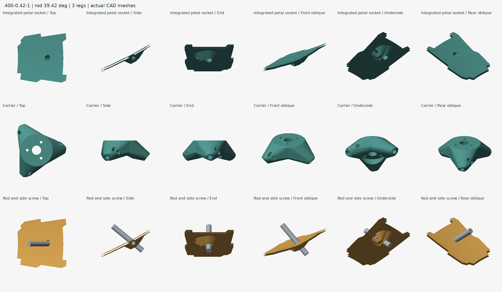
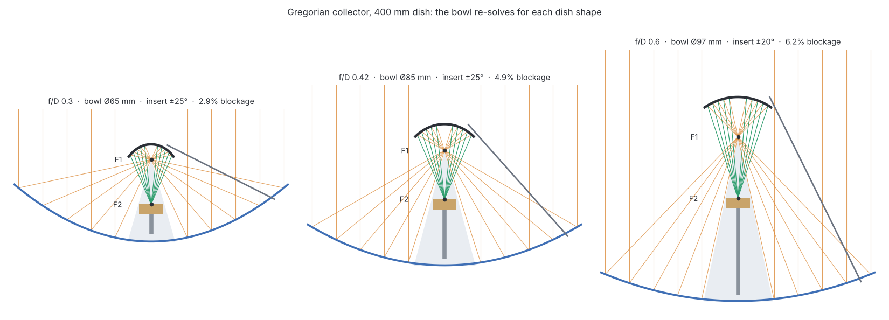

# Compact feed support and frequency sizing — PETAL 5.3 · accessory revision 7

## Direct petal attachment

The rod passes directly through an angled hole in a selected outer petal. A compact underside saddle is continuous with the shell. An M3 × 12 headless side screw and short M3 heat-set insert retain the rod. There is no separate rim shoe, rear backer, pair of mounting bolts or rim-bolt washer stack.

Small circular tapers blend into the underside. The rod bore has 45° roof shoulders and a 0.8 mm bridge in the actual side-print direction; the side insert pilot is circular. These new petal sockets are designed for support-free printing in the exported orientation. The unchanged carrier and secondary still need their own slicer support review.

Three rods use the fewest parts; four remain available. Regenerate mounting petals, carrier and rod cuts together. Changing rod count can change segmentation. Use the generated PDF and hardware CSV: the petal uses **short M3 heat-set inserts**, maximum 4 mm long, compatible with a 4.2 mm pilot, while the carrier uses **M3 hex nuts**.

The lower rod datum is now under the reflector. Its crossing of the front face is solved for the chosen dish curve; cuts and angles are recalculated. The 18 mm front-face insertion mark includes any rear protrusion through the open bore, rather than promising 18 mm continuous plastic contact. The carrier keeps its 16–19 mm engagement range. No strength rating follows from geometry checks alone.

## Frequency is an input, not a complete antenna design

For frequency ν in GHz, wavelength in mm is `λ = 299.792458 / ν`. The primary focal length is `f = D × f/D`. **Changing frequency alone does not move the focus of an unchanged parabola.**

| Generator control | What changes |
| --- | --- |
| Frequency + automatic secondary sizing | Target secondary diameter, solved hyperbola position, rod angles/cuts and center standoff |
| Frequency + automatic bowl sizing (collector) | Bowl diameter in wavelengths when that exceeds the smallest bowl that shades the insert; ellipse, F2, rods and mast follow |
| Actual feed phase offset in mm | Prime-focus puck position and rod angles/cuts |
| Known feed phase offset in wavelengths | Converts the supplied feed-specific offset using frequency, then recalculates puck and rods |
| Automatic solid-rod diameter | Chooses 4, 5, 6, 6.35, 8, 10, 12 or 12.7 mm from span, entered payload and deflection budget |
| Manual solid-rod diameter | Uses a user-entered 2–12.7 mm diameter, in mm or inches; warns if over the screening deflection budget |
| Frequency in either optical mode | Reports wavelength and surface-error screening budget |

Changing frequency, phase offset or rod diameter can change the fixed socket angles and bore sizes. Regenerate the mount petals, carrier and rod cut list together; changing the metal rods alone is not always sufficient.

The phase offset in wavelengths is for a **known, scalable feed design**. It is not a universal horn/patch/helix phase-center model. Entering frequency does not synthesize an RF feed, select polarization or establish bandwidth. Default zero offset means the actual feed datum has not been supplied.

## Prime focus and secondary optics

A prime-focus antenna places the actual feed's phase center at the parabola focus, facing the main dish. The puck lower-face datum is `f − phase offset`, with positive offset along +z away from the main reflector. All coordinates refer to the extrapolated parabola vertex, not the rim or rear hub.

A Cassegrain uses a **convex hyperbolic secondary**, with one hyperbola focus at the primary focus and the other at the rear feed's phase center. An arbitrary flat disc or small parabola at the main focus is not interchangeable with this system.

For primary focus f, rear focus g<0 and secondary vertex v:

- `center = (f+g)/2`, `c = (f−g)/2`, `a = v−center`, `b² = c²−a²`.
- Reflecting surface: `z(r) = center + a √(1+r²/b²)`.
- Intersect the primary rim-to-focus ray with this surface; extend its radius by 4% as a geometric margin.

Automatic sizing targets the entered diameter in wavelengths (default **4λ**), subject to a **56 mm mechanical minimum** and a **25% primary-diameter ceiling**. Bisection solves the secondary vertex for that diameter. The program then recomputes all support coordinates. It does not optimize taper, blockage or sidelobes. The 25% ceiling is a prototype packaging limit; a smaller secondary-to-primary ratio can be preferable electromagnetically.

For a 400 mm dish, a 4λ secondary is approximately 500 mm across at 2.4 GHz: automatic mode rejects that combination. Prime focus is the practical starting point at that scale. At 15 GHz the target is about 80 mm; at 20 GHz it is about 60 mm. These examples still need appropriate feed design and electromagnetic analysis. Below five wavelengths the UI specifically flags diffraction; this is not an absolute RF pass/fail threshold.

The returned ray bundle must clear the 30 mm hub with 1.5 mm radial margin. This does not certify physical clearance for a rear horn, connector or cable. A small central standoff is generated in 5 mm increments so rods clear the secondary edge. It is part of the single puck, not a separate arm structure.

The secondary is a 3 mm shell with a central boss and one blind short-M4-insert pocket. No screw breaks the reflecting face. Use the generated hardware schedule: puck/standoff height changes the screw length. A 4 mm total metal washer/spacer stack leaves nominally 5 mm screw entry. Verify actual insert length and tip clearance before tightening.

## Gregorian collector

The collector layout uses the dish to gather rather than to radiate. A concave bowl hangs just beyond the prime focus, facing the dish. Rays from the dish converge on F1, cross it, reflect off the bowl and come back down to a second focus F2 below it. The receiving insert sits at F2, looking up into the bowl, on a short tube mast from the hub. The rods socket directly into fins on the bowl, so there is no separate carrier or adapter.

**Why an ellipsoid.** A reflector that sends every ray through one point to a second point is an ellipsoid with those two points as foci. With F1 at the dish focus and F2 at the insert's phase center, every dish ray folds to the insert. This is the Gregorian dual reflector; the Cassegrain mode uses a convex hyperboloid instead and puts the feed behind the dish. About F1, with ψ measured from the dish axis (ψ = 0 at the bowl vertex):

`t(ψ) = b² / (a + c·cos ψ)`, with `c = |F1F2| / 2`, `a = (|PF1| + |PF2|) / 2` at any surface point P, and `b² = a² − c²`.

**How it follows the dish.** Every build re-solves the bowl from D and f/D:

- Rim angle `ψ0 = 2·atan(D / 4f)`. The bowl edge sits at `ψ0 + 3°`, so it catches every dish ray with a little spill margin.
- The insert half-angle θ is the angle at F2 to the bowl edge. For a bowl radius `r`, the focus spacing is `|F1F2| = r·(cot θ − cot ψE)`.
- Magnification `M = (1 + e) / (1 − e) = tan(ψE / 2) / tan(θ / 2)`, with `e = c / a`. The insert sees an equivalent dish of `f/D × M`, so a deep dish can be fed by an ordinary moderate-beam insert.

A deeper dish (larger ψ0) or a narrower insert beam spreads F1 and F2 apart. A wider insert beam pulls F2 up toward the bowl; a larger insert needs a larger bowl.

**Sizing rule: hide the insert in the bowl's shadow.** Dish rays inside the bowl's radius never reach the dish, so a cone below F1, of half-angle `2·atan((r + lip) / 2f)`, carries no energy. The insert cup and mast go inside that cone, so the bowl is the only blocking object. This is the minimum-blockage condition for dual reflectors (Wade: the feed's blockage should not exceed the subreflector's). Auto sizing bisects for the smallest bowl that shades the insert cup with 1 mm to spare, or the entered number of wavelengths when a frequency is set, whichever is larger. Manual sizing takes your diameter and rejects one that cannot hide the insert.

**RF guidance.** These are ray-optics rules; diffraction is not modeled.

| Check | Rule used | What the app does |
| --- | --- | --- |
| Bowl size | Above ~10 λ works well; 5–10 λ loses some gain to diffraction; below ~5 λ prime focus usually wins | Warns below 10 λ and below 5 λ |
| Blockage | Area fraction `((r + lip) / R)²` | Reports it; warns above 5%; refuses bowls over 30% of D |
| Insert far field | Bowl at least `2d² / λ` from the insert | Warns when the bowl is closer |
| Insert beam | −10 dB edge near ±θ | θ is the input; the dish rim lands slightly inside it |

At 10 GHz a 400 mm, f/D 0.42 dish gets a 4 λ (120 mm) bowl by default, which the app flags. At 24 GHz the same 4 λ is a 50 mm target, so the shadow rule sets the size (about 85 mm, 6.8 λ). Larger dishes and higher frequencies are where the collector earns its keep.

**Mechanics.** The reflecting face is the exact ellipsoid; a ray cast against the printed mesh finds it within 0.01 mm everywhere inside the rim. The bowl prints on its flat top with the reflecting face up and no supports: the back follows the face at 3 mm or a 45° cone, whichever is steeper. Where each rod goes in, the wall thickens between the flat top and the rim, so nothing hangs below the rim or into the signal path. The rod runs just above the back cone, enters at the rim and stops inside the thickened wall, with 1.5 mm of wall over the reflecting face and 1 mm under the top. Each seat is the rod's collar swept at 45° up to the flat top, so it stands on the bed in print. One cross bolt (M3 for rods 6 mm and up, M2 below) passes through flat side faces in open air and is match-drilled through the rod. The bowl end takes 1.6 rod diameters of engagement (at least 8–10 mm), because the bolt pins it. The mast foot bolts to the flat hub front on the four hub-to-mount through bolts; the cup and foot each take an M3 set screw into a short heat-set insert. The cable runs inside the mast and out through the hub center. Very deep dishes leave no room for a tube, and the cup then stands on a printed pedestal.

## Rod cuts, tolerances and retention

**Where the rods start.** The lower datum is 20 mm inside the rim when that rod is at most 580 mm long. On a larger dish the datum moves in toward the hub, in 5 mm steps, to the outermost radius whose rod is 580 mm or shorter and no steeper than 62° (the steepest bore the petal sockets have been checked for), and the sockets go on whichever ring holds that radius (with room for the socket and 8 mm to each ring seam). When no datum meets both (a long focus, a Cassegrain carrier or a collector bowl on a large dish, where the rise alone is most of the rod), the datum stays at the rim: moving in would barely shorten the rod and would narrow the support. No rod may exceed 1 m. On a 1200 mm dish at f/D 0.42 on a 300 mm bed, that puts the prime-focus datum at r 370 mm on ring 2 of 3 (580 mm rods); the Cassegrain and collector rods start at the rim (679 and 659 mm). A 1200 mm dish at f/D 0.8 needs rods over 1 m and is refused.

The underside petal datum and carrier datum determine span S. The lower front-face crossing is solved from the parabola; the upper entrance remains 22 mm from its datum:

`rod cut = S − lower entrance − upper entrance + 36 mm`.

The entrance distances, cut and leg positions are included in `RODS.csv`. The petal hole is through, with no floor. Only the carrier has a bore floor, 2 mm from its datum.

At the carrier, keep 16–19 mm engagement and at least 1 mm clearance above its bore floor. Align the lower 18 mm mark with the front-face center crossing; the rod may protrude under the petal. Deburr, mark insertion depths and trial-fit before final trimming. The rods are not printed; use smooth **solid** aluminum stock. Tubing requires a different clamp and section calculation, because a radial screw can crush it. The purchased rod diameter and generated socket clearance must match.

The radial M3×10 screw threads through a real M3 nut in a **side-loading captured pocket**. The nut has a retaining roof in the screw-load direction; it is not simply pressed into an outward-open recess. No printed threads. Test screw-tip contact, slip and repeatability with the actual rod and filament. Mark the rod for visual slip detection. Do not interpret screw engagement as a validated clamp-force rating.

Align the puck with an independent center/height jig. Tighten incrementally without using any rod to pull a warped petal into shape. Recheck alignment at different dish elevations and after warm soaking. The puck has three/four M3 adapter holes on a 24 mm bolt circle, midway between rods, with a 12 mm prime-focus cable opening. This is PETAL's interface, not a standard feed flange; a feed-specific adapter remains necessary.

## Mechanical and RF screening

Automatic stock selection uses `δ = FL³/(3EI)`, `I = πd⁴/64`, E=69 GPa, and the entire entered supported payload acting transversely on one exposed rod span. This is a deliberately conservative **single-cantilever screen**, not an analysis of the assembled truss. The limit is `min(1 mm, λ/50)`; unknown frequency uses 1 mm. Include the feed/secondary, puck, adapter, fasteners and cable reaction in the entered load. Wind, joints, resonance, buckling, temperature and polymer creep are not modeled. No supported mass or wind rating is assigned.

The displayed surface-RMS budget is λ/40. In the Ruze random-error approximation, that corresponds to roughly 0.43 dB surface-error loss alone; systematic petal distortion, gaps, blockage and feed losses are additional effects. This budget is not a measurement of the printed surface or a complete focus-position tolerance. Rod-screening deflection is likewise not a prediction of RF loss.

Print mounting petals in their exported side-print orientation; the new socket roofs and underside ramps are aligned for support-free printing. Print the carrier top-face down; its existing circular bores and hex-nut pockets may need localized supports. Print the secondary boss-down with support under the surrounding rear shell. Start with four perimeters and locally solid fitting walls; inspect the actual sliced wall paths. PETG is useful for indoor fit tests; ASA can be appropriate for outdoor UV exposure with an enclosed printer. Qualify creep and alignment at the actual service temperature.

Cover the dish-facing reflector surfaces with continuous, well-bonded aluminum/copper foil or a verified conductive coating. Ordinary metallic-looking paint is not an RF conductivity specification. Foil wrinkles, seams, adhesive thickness and assembly steps all consume the surface-error budget. Mask mounting datums and bores; fit first and coat afterward. Verify electrical continuity, then measure RF performance with stable feed alignment.

## Sources and verification scope

- [Paul Wade, W1GHZ: Multiple Reflector Dish Antennas](https://www.w1ghz.org/antbook/conf/Multiple_reflector_antennas.pdf): Gregorian ellipse foci, magnification and eccentricity, subreflector size and feed blockage.
- [T. L. Wilson: Techniques of Radio Astronomy](https://arxiv.org/abs/1111.1183): dual-reflector systems, aperture blockage and efficiency.
- [MathWorks: Cassegrain geometry and electromagnetic analysis](https://www.mathworks.com/help/antenna/ug/design-and-analyze-cassegrain-antenna.html): separate horn design; example 4λ secondary; hybrid solvers and diffraction considerations.
- [NRAO: surface errors and the Ruze approximation](https://naic.nrao.edu/arecibo/phil/sysperf/misc/surfaceErrorsRuze.html).
- [RF HAMDESIGN: three-leg accessory examples](https://www.rfhamdesign.com/products/parabolicdishkit/accessories/index.php).
- [Prusa material guide](https://help.prusa3d.com/filament-material-guide): PETG and ASA printing/material considerations.
- [Manifold](https://github.com/elalish/manifold): Boolean geometry kernel used by the online and offline app; see `THIRD-PARTY-NOTICES.md`.

Automated checks cover closed meshes, winding, quantities, print bounds, generated cuts and datums, wavelength sizing, fixed primary focus, rod screening, exports, independent hyperbola reflection/path checks and ellipse ray traces to F2 for several dish shapes. Sampled mesh interference checks and OpenSCAD comparisons complement them. These are geometry/software checks, not a slicer, physical load test, electromagnetic simulation or measured antenna qualification.
