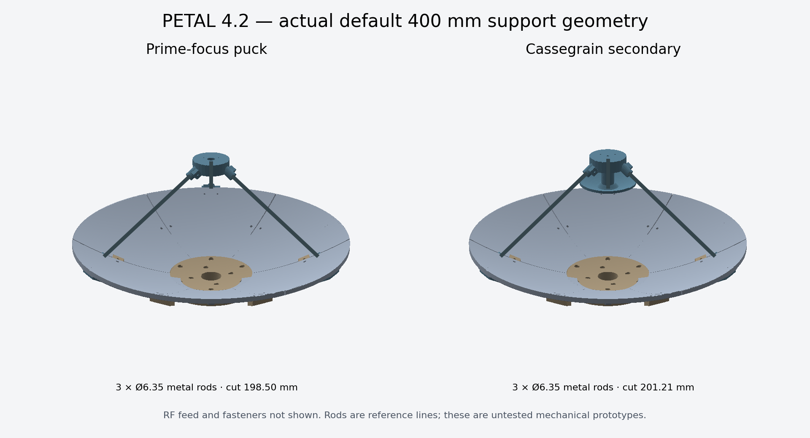

# Compact feed support and frequency sizing — PETAL 4.2

## What changed

The revision-1 clevises, pivot pins, long rod ends and broad carrier arms have been replaced by **small bolted rim shoes, slim rear backers, long metal rods and one round puck**. The puck body is 52 mm across; its short integrated sockets extend beyond that diameter. Each shoe has a 20 × 28 mm footprint and a 3 mm curved sole with an integral socket-root boss. Socket axes are generated at the calculated rod angle. There are no adjustable hinges to lock.

The shoe follows the parabola with a small manufacturing clearance. Its backer follows a tangent datum, avoiding a deep flat wedge across the curved petal. The local reinforced mounting area uses paired M3 through holes near the rim. This is the bolted attachment option: no friction-only snap latch is relied on for sustained load. Revision-2 mount petals and accessories must be regenerated together; they do not fit the revision-1 accessory holes. The dish seam/hub interface remains revision 9.

Three rods use the fewest parts. Four rods are available, with the fourth fitted last without preload. Compatible equal-angle petal segmentation is still required; changing between three and four rods can require regenerating the entire matching dish/hub.

For the default 400 mm three-rod example, solid printed CAD volume (excluding sacrificial supports, rods and hardware) is 604.57 cm³ without the accessory, 662.21 cm³ with prime-focus support, and 687.93 cm³ with the secondary. Prime-focus accessory volume falls from 400.74 cm³ in revision 1 to 57.64 cm³: about **86% less printed support material**. Nominal rods are 198.50 mm for prime focus and 201.21 mm for the example secondary. These are CAD volumes, not measured print weights.

## Frequency is an input, not a complete antenna design

For frequency ν in GHz, wavelength in mm is `λ = 299.792458 / ν`. The primary focal length is `f = D × f/D`. **Changing frequency alone does not move the focus of an unchanged parabola.**

| Generator control | What changes |
| --- | --- |
| Frequency + automatic secondary sizing | Target secondary diameter, solved hyperbola position, rod angles/cuts and center standoff |
| Actual feed phase offset in mm | Prime-focus puck position and rod angles/cuts |
| Known feed phase offset in wavelengths | Converts the supplied feed-specific offset using frequency, then recalculates puck and rods |
| Automatic solid-rod diameter | Chooses 4, 5, 6, 6.35 or 8 mm from span, entered payload and deflection budget |
| Manual solid-rod diameter | Uses selected stock; warns if over the screening deflection budget |
| Frequency in either optical mode | Reports wavelength and surface-error screening budget |

Changing frequency, phase offset or rod diameter can change the fixed socket angles and bore sizes. Regenerate the shoes, puck and rod cut list together; changing the metal rods alone is not always sufficient.

The phase offset in wavelengths is for a **known, scalable feed design**. It is not a universal horn/patch/helix phase-center model. Entering frequency does not synthesize an RF feed, select polarization or establish bandwidth. Default zero offset means the actual feed datum has not been supplied.

## Prime focus and secondary optics

A prime-focus antenna places the actual feed's phase center at the parabola focus, facing the main dish. The puck lower-face datum is `f − phase offset`, with positive offset along +z away from the main reflector. All coordinates refer to the extrapolated parabola vertex, not the rim or rear hub.

A Cassegrain uses a **convex hyperbolic secondary**, with one hyperbola focus at the primary focus and the other at the rear feed's phase center. An arbitrary flat disc or small parabola at the main focus is not interchangeable with this system.

For primary focus f, rear focus g<0 and secondary vertex v:

- `center = (f+g)/2`, `c = (f−g)/2`, `a = v−center`, `b² = c²−a²`.
- Reflecting surface: `z(r) = center + a √(1+r²/b²)`.
- Intersect the primary rim-to-focus ray with this surface; extend its radius by 4% as a geometric margin.

Automatic sizing targets the entered diameter in wavelengths (default **4λ**), subject to a **56 mm mechanical minimum** and a **25% primary-diameter ceiling**. Bisection solves the secondary vertex for that diameter. The program then recomputes all support coordinates. It does not optimize taper, blockage or sidelobes. The 25% ceiling is a prototype packaging limit; a smaller secondary-to-primary ratio can be preferable electromagnetically.

For a 400 mm dish, a 4λ secondary is approximately 500 mm across at 2.4 GHz: automatic mode rejects that combination. Prime focus is the practical starting point at that scale. At 15 GHz the target is about 80 mm; at 20 GHz it is about 60 mm. These examples still need appropriate feed design and electromagnetic analysis. Below five wavelengths the UI specifically flags diffraction; this is not an absolute RF pass/fail threshold.

The returned ray bundle must clear the 30 mm hub with 1.5 mm radial margin. This does not certify physical clearance for a rear horn, connector or cable. A small central standoff is generated in 5 mm increments so rods clear the secondary edge. It is part of the single puck, not a separate arm structure.

The secondary is a 3 mm shell with a central boss and one blind short-M4-insert pocket. No screw breaks the reflecting face. Use the generated hardware schedule: puck/standoff height changes the screw length. A 4 mm total metal washer/spacer stack leaves nominally 5 mm screw entry. Verify actual insert length and tip clearance before tightening.

## Rod cuts, tolerances and retention

The physical socket-end coordinates determine span S. Each socket is 22 mm long with a bore beginning 2 mm from its blind end. At 18 mm nominal engagement, the rod end sits 4 mm from the socket end:

`rod cut = S − 2 × (22−18) = S − 8 mm`.

Keep 16–19 mm engagement and at least 1 mm clearance above the bore floor at maximum insertion. Deburr, mark insertion depths and trial-fit before final trimming. The rods are not printed; use smooth **solid** aluminum stock. Tubing requires a different clamp and section calculation, because a radial screw can crush it. The purchased rod diameter and generated socket clearance must match.

The radial M3×10 screw threads through a real M3 nut in a **side-loading captured pocket**. The nut has a retaining roof in the screw-load direction; it is not simply pressed into an outward-open recess. No printed threads. Test screw-tip contact, slip and repeatability with the actual rod and filament. Mark the rod for visual slip detection. Do not interpret screw engagement as a validated clamp-force rating.

Align the puck with an independent center/height jig. Tighten incrementally without using any rod to pull a warped petal into shape. Recheck alignment at different dish elevations and after warm soaking. The puck has three/four M3 adapter holes on a 24 mm bolt circle, midway between rods, with a 12 mm prime-focus cable opening. This is PETAL's interface, not a standard feed flange; a feed-specific adapter remains necessary.

## Mechanical and RF screening

Automatic stock selection uses `δ = FL³/(3EI)`, `I = πd⁴/64`, E=69 GPa, and the entire entered supported payload acting transversely on one exposed rod span. This is a deliberately conservative **single-cantilever screen**, not an analysis of the assembled truss. The limit is `min(1 mm, λ/50)`; unknown frequency uses 1 mm. Include the feed/secondary, puck, adapter, fasteners and cable reaction in the entered load. Wind, joints, resonance, buckling, temperature and polymer creep are not modeled. No supported mass or wind rating is assigned.

The displayed surface-RMS budget is λ/40. In the Ruze random-error approximation, that corresponds to roughly 0.43 dB surface-error loss alone; systematic petal distortion, gaps, blockage and feed losses are additional effects. This budget is not a measurement of the printed surface or a complete focus-position tolerance. Rod-screening deflection is likewise not a prediction of RF loss.

Print the shoe on its exported side and the puck top-face down. Check horizontal socket roofs, nut pockets and screw channels in the slicer, adding support where needed. Print backers flat. Print the secondary boss-down with support under the surrounding rear shell. Start with four perimeters and locally solid fitting walls; inspect the actual sliced wall paths. PETG is useful for indoor fit tests; ASA can be appropriate for outdoor UV exposure with an enclosed printer. Qualify creep and alignment at the actual service temperature.

Cover the dish-facing reflector surfaces with continuous, well-bonded aluminum/copper foil or a verified conductive coating. Ordinary metallic-looking paint is not an RF conductivity specification. Foil wrinkles, seams, adhesive thickness and assembly steps all consume the surface-error budget. Mask mounting datums and bores; fit first and coat afterward. Verify electrical continuity, then measure RF performance with stable feed alignment.

## Sources and verification scope

- [MathWorks: Cassegrain geometry and electromagnetic analysis](https://www.mathworks.com/help/antenna/ug/design-and-analyze-cassegrain-antenna.html): separate horn design; example 4λ secondary; hybrid solvers and diffraction considerations.
- [NRAO: surface errors and the Ruze approximation](https://naic.nrao.edu/arecibo/phil/sysperf/misc/surfaceErrorsRuze.html).
- [RF HAMDESIGN: three-leg accessory examples](https://www.rfhamdesign.com/products/parabolicdishkit/accessories/index.php).
- [Prusa material guide](https://help.prusa3d.com/filament-material-guide): PETG and ASA printing/material considerations.
- [Evan Wallace's CSG implementation](https://github.com/evanw/csg.js): MIT-licensed Boolean kernel, vendored for offline procedural fitting generation; see `THIRD-PARTY-NOTICES.md`.

Automated checks cover closed meshes, winding, quantities, print bounds, generated cuts and datums, wavelength sizing, fixed primary focus, rod screening, exports and independent hyperbola reflection/path checks. Sampled mesh interference checks and OpenSCAD comparisons complement them. These are geometry/software checks, not a slicer, physical load test, electromagnetic simulation or measured antenna qualification.
