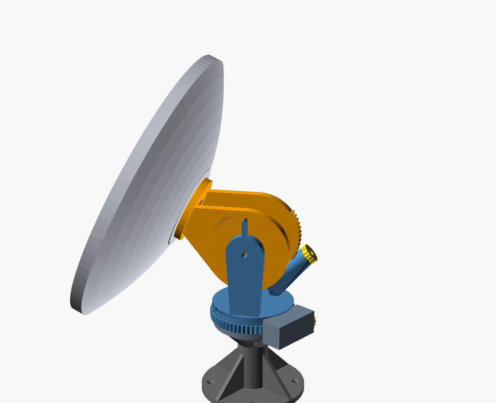
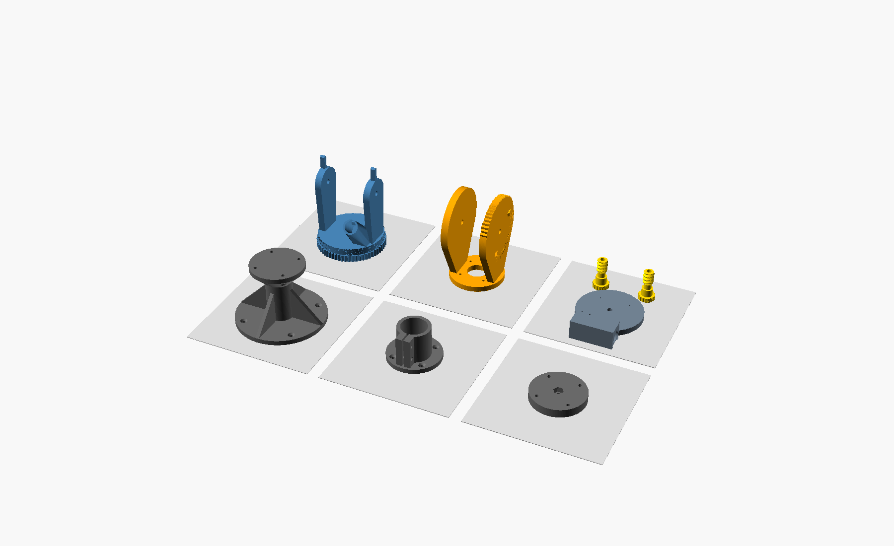
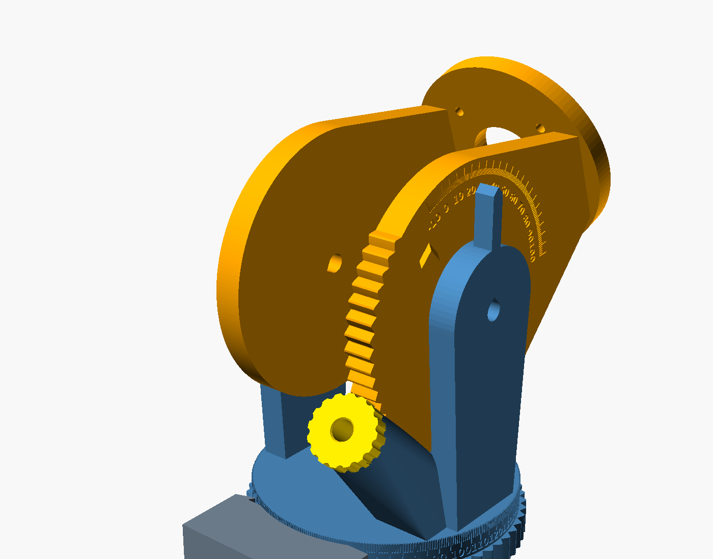

# Geared alt-az head — revision 3

An all-printed aiming head for the 400 mm PETAL. Each axis is one printed worm turning a printed gear. You aim by turning a knob; the worm is self-locking, so the dish stays wherever you stop. No pins, detents or springs.

| | |
|---|---|
| Drive | Worm + gear on both axes, **6° per knob turn**, 12 knob ticks = 0.5° each |
| Elevation | −5° to 100°, hard stops at about −8° and 104° |
| Azimuth | 360°, continuous |
| Readout | 1° scales: elevation on the ear faces, azimuth on the head's band |
| Hold | Self-locking worm (lead 7.1°, friction angle about 20°); gravity on the teeth is about 4 MPa |
| Interface | Base plate with 4 × M5 heat-set inserts on a 50 mm square |
| Supports | none — no surface steeper than 45°, no bridges |

The two worms are **the same part**. Print a spare and it fits either axis.

## Parts

Default STLs are in `cad/STL/`, already in print orientation. Load and slice without rotating.

| Part | STL | Prints | Footprint (mm) | Notes |
|---|---|---|---|---|
| Worm ×2 | `geared-worm.stl` | knob down | 28 × 28 × 54 | Same part for both axes |
| Head | `geared-head.stl` | gear face down | 122 × 139 × 164 | Azimuth gear ring, scale band, cheeks, elevation worm housing |
| Cradle | `geared-cradle.stl` | hub face down | 94 × 117 × 161 | Bolts to the PETAL hub; right ear carries the elevation gear sector and stop lugs |
| Base | `geared-base.stl` | flat | 112 × 141 × 33 | Fixed; holds the azimuth worm and the mounting interface |
| Stand | `geared-stand.stl` | foot down | 150 × 150 × 105 | Optional bench stand |
| Pipe adapter | `geared-pipe-adapter.stl` | plate down | 90 × 90 × 58 | Optional; clamps a 1-1/4" NPS pipe mast (42.2 mm OD) |
| Tripod puck | `geared-tripod-puck.stl` | flat | 90 × 90 × 14 | Optional; 3/8-16 tripod screw |

### Why the teeth print without supports
Both gears use a 48° pressure angle instead of the usual 20°.
- **Worm:** prints upright, and its thread flanks lean 42° from vertical, helix included.
- **Ear teeth:** the elevation sector prints sideways. Its teeth all point within 66° of print-up, so every flank stays under 45°.
- **Elevation housing:** the worm axis sits 50° from vertical. That lets the housing's bore and nut pocket print as plain tilted holes.
- **Horizontal holes:** these get 45° teardrop or roofed-hex tops.
- **Blind holes:** these end in 45° drill points.

## Hardware

| Qty | Item | Use |
|---|---|---|
| 4 | M4 × 16 socket head + washer | cradle → PETAL hub mount inserts |
| 2 | M8 × 40 socket head, 2 washers, nylock | elevation axle, one per side |
| 2 | M8 × 75 socket head, washer, nylock | worm axles (bolt head on the knob, nylock in the housing pocket) |
| 1 | M8 × 50 **flat-head countersunk** (ISO 10642), washer, nylock | azimuth pivot, from under the base |
| 4 | M5 heat-set insert (≈Ø6.4 pilot, ≤ 8 mm long) | base interface |
| 4 | M5 flat-head: × 16 for the stand and pipe adapter, × 20 for the tripod puck | mount → base |
| 2 | M5 × 25 socket head + nut | pipe-adapter pinch bolts |
| 1 | 3/8-16 hex nut | tripod puck |
| 4 | #10 / M5 flat-head wood screws | stand → bench |

## Print settings (ASA-GF)

- Hardened nozzle, enclosure, brim on the head and stand.
- Turn on the slicer's **elephant-foot compensation** (about 0.2 mm). The gear faces print on the bed, and a squished first layer adds backlash.
- **Walls:**
  - Worm: 5.
  - Head and cradle: 5–6.
  - Base and adapters: 4.
- **Infill:** 40% on the worm, 30% gyroid on the head, cradle and base, 15–20% on the stand.
- **Supports:** off.
- **Worm:** print one at a time, at 0.12–0.16 mm layers, so the thread flanks come out smooth.

## Assembly

1. **Inserts.** Heat-set the 4 M5 inserts into the base's underside.
2. **Azimuth pivot.**
   - Push the M8 flat-head up through the base's countersink.
   - Set the head on it, gear ring down.
   - Washer and nylock on top of the head, between the cheeks.
   - Snug until the head turns with an even, light drag.
3. **Azimuth worm.**
   - Drop a nylock into the base housing's nut pocket.
   - Slide the worm in, knob outward.
   - Feed an M8 × 75 through the knob and thread it into the nylock.
   - Stop when there is no end play but the knob still turns freely.
4. **Mount.** Bolt the stand, pipe adapter or tripod puck to the base with M5 flat-heads from below.
5. **Cradle on the dish.** Hub face against the PETAL hub, 4 × M4 × 16 into the mount inserts. The ears clear every root-screw head, and the Ø34 port stays open.
6. **Cradle into the head.**
   - Lower the ears between the cheeks; the toothed ear goes on the right side.
   - M8 × 40 through each cheek and ear, nylock inside.
   - Snug, so the ears turn without wobble.
7. **Elevation worm.**
   - Nylock into the pocket at the far end of the cheek housing.
   - Slide the worm in, knob up and to the rear.
   - Turn the knob as it enters so the thread picks up the ear teeth.
   - Bolt it the same way as the azimuth worm.
8. **Level and align.**
   - Level the head's gear band; it is the 0° elevation reference.
   - Turn the azimuth knob until the band reads your reference (true north or a known landmark) at the pointer. Then rotate the stand or mount to point the dish at it.
9. **Coax.** It runs out the Ø34 port and down behind the head. Azimuth has no stop, so don't wind more than one full turn in either direction.

## Using it

- **Elevation:** turn the rear knob. Read degrees on the ear scale at the cheek's pointer.
- **Azimuth:** turn the side knob on the base. Read degrees on the band at the pointer fin beside the azimuth housing.
- **Fine peaking:** each knob tick is 0.5°. Turn while watching your meter; nothing needs locking afterwards.
- **Big moves:** 90° is 15 turns. The bolt through each worm is a fixed axle, so turn the knob itself.

## Validation

`scripts/check-geared-mount.py <stl dir>` reloads the STLs, places them with the same math as the SCAD, and checks:

- **Bed fit:** closed meshes that fit the bed.
- **Housings:** each worm turns freely in its housing.
- **Gear mesh:** at 8 elevations and 4 azimuths, the worm finds a clear tooth phase. Turning it ±60° off that phase drives about 18 mm³ into the teeth, which proves real engagement.
- **Stops:** where they engage, and that the worm is still fully meshed there.
- **Elevation sweep:** cradle and dish envelope against head and worm across the full travel.
- **Azimuth sweep:** 0–345° at four elevations, against the base, the azimuth worm and the stand.
- **Rim clearance:** the rim stays above the bench.
- **Hub interface:** the 4 × M4 holes, the port and the root-screw band.

`scripts/check-printability.py *.stl` scans for overhangs and bridges. Run it on a `-D engrave=0` export; with engraving on, it also flags the tops of the 0.6 mm-deep digit recesses.

## Limits

The dish envelope in the sweep covers the shell and hub only, so check your feed rods, rim shoes and coax by hand before relying on the low end of travel. The default dish is assumed: other diameters and f/D values change the stand height (the SCAD recomputes it), but larger dishes add load the printed teeth weren't sized for. Bolt the stand down; at the horizon the dish's center of mass sits forward of its foot.
