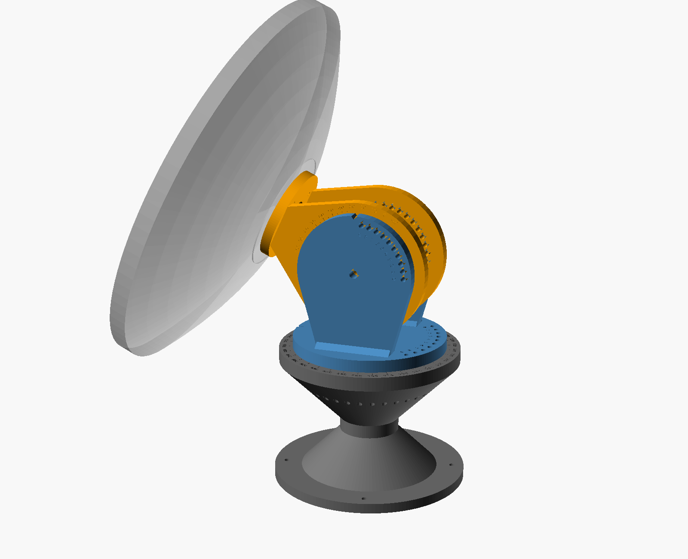
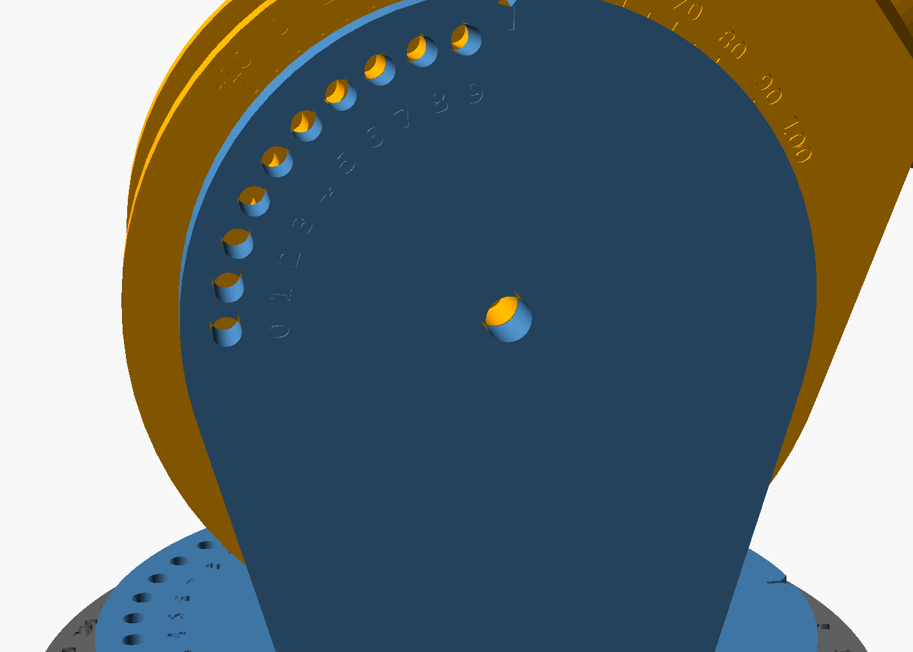

# Indexed alt-az mount — revision 1



An all-printed bench mount for the 400 mm PETAL. Elevation and azimuth each lock with one steel pin through a vernier pair of hole rings, giving a positive stop at **every 1°** (or 2° / 3° — see `step`). No gears, no printed threads, no friction-only settings.

| | |
|---|---|
| Elevation | −5° to 100° (rim ≥ 15 mm above bench at −5°) |
| Azimuth | 360°, continuous |
| Increment | 1° default; `step = 2` or `3` for fewer, beefier holes |
| Lock repeatability | ±0.2° at a 0.3 mm pin clearance (tighter if reamed) |
| Axle height | 229 mm above bench |
| Port | Ø34 clear behind the hub's Ø30 opening |

## Parts

All in `cad/indexed-mount.scad`; default STLs in `cad/STL/`, already in print orientation.

| Part | STL | Bed footprint | Prints |
|---|---|---|---|
| Column | `indexed-column.stl` | 196 × 196 × 139 | upright, foot down |
| Head (azimuth disk + elevation cheeks) | `indexed-head.stl` | 156 × 156 × 148 | disk down |
| Cradle (hub ring + ears) | `indexed-cradle.stl` | 94 × 136 × 168 | hub face down |

All three fit a 220 × 220 × 250 bed with 8 mm margin. Support-free: the column's two cones are 45°, and the only horizontal holes are Ø5.3 / Ø8.4 in the cheeks and ears.

## Hardware

| Qty | Item | Use |
|---|---|---|
| 4 | M4 × 16 socket head + M4 washer | cradle → hub mount inserts (10 mm ring + 1 mm washer = 5 mm insert entry) |
| 2 | M8 × 40 socket head, 2 washers each, M8 nylock | elevation axle, one stub per side |
| 1 | M8 × 35 hex head, fully threaded (DIN 933), washer, nylock | azimuth clamp; head drops up the column's hex bore |
| 2 | Ø5 × 35 steel clevis pin + R-clip | elevation lock, one per side (one alone works) |
| 1 | Ø5 × 60 steel clevis pin + R-clip | azimuth lock (clip goes under the column cone) |
| 4 | M5 / #10 bench screws | column foot, Ø5.5 holes on 172 mm circle |

Ø5 × 35 and Ø5 × 60 ball-lock quick-release pins are a faster swap for the clevis pins.

## Print and finish (ASA-GF)

- Hardened nozzle, enclosure, brim. 5–6 walls on head and cradle so the pin and axle holes sit in solid perimeters; 30–40% gyroid infill. Column 15–20% infill.
- Holes are modeled at Ø5.3 and Ø8.4. Run a **5.0 mm drill through each pin hole one part at a time** — never drill a mated pair, that moves the hole. Pin should slide in by hand with no rock.
- Engraved scales are 0.6 mm deep; a paint-pen wipe and a scraper make them readable.

## Assembly

1. **Column.** Turn it upside down, drop the M8 × 35 hex bolt shank-first into the bottom bore so the head seats in the hex at the top. Flip, set the head on the flange, washer + nylock. Snug until the head turns by hand with a firm, even drag.
2. **Level and orient.** Shim the foot so the head disk is level (this is the 0° elevation reference). Rotate the column until its **0** mark faces your azimuth reference (true north, a bench edge), then screw the foot down. Bolt it down — at the horizon the dish's center of mass is forward of the foot.
3. **Cradle on dish.** Hub face against the PETAL's flat rear hub, 4 × M4 × 16 into the mount inserts. Ears clear every root-screw head; the cradle stays on for transport.
4. **Cradle into head.** Lower the ears between the cheeks, M8 × 40 through cheek + ear on each side, nylock on the inside face. Snug so the dish holds its own weight with the pins out but moves with a firm push.
5. **Coax** runs out the Ø34 port, straight back between the ears and out behind the axle. Leave a loop for azimuth travel.

## Setting an angle

Each axis has a coarse scale (every 10°) and ten fine holes labeled **0–9**.

1. Hold the dish, pull the pin.
2. Swing until the pointer sits on the **10s mark at or below** your target — the notch on top of the cheek for elevation, the notch on the head disk's front edge for azimuth.
3. Put the pin in the fine hole labeled with your target's **last digit**, and nudge the dish until it drops through. Only that pair lines up; its neighbors are 1° off and the pin won't enter them.

| Target | Coarse mark | Fine hole |
|---|---|---|
| El 37° | 30 | 7 |
| El −4° | −10 | 6 |
| Az 215° | 210 | 5 |



Elevation pins go in from the outside of each cheek, R-clip inside. With `step = 2` the fine holes read 0/2/4/6/8; with `step = 3` the coarse pitch becomes 15° and fine holes read 0/3/6/9/12 (add the fine label to the coarse mark).

## Parameters

`step`, `dish_d`, `dish_fd`, `el_min`, `pin_d` and `pin_fit` are at the top of the SCAD. `dish_d` / `dish_fd` / `el_min` set the column height so the rim clears the bench; the dish standoff (100 mm hub face to axle) is sized so the dish back clears the column flange by 6 mm at −5° and 16 mm at 0°. Re-run the check after changing anything:

```sh
openscad -o cradle.stl -D 'part="cradle"' -D printing=true cad/indexed-mount.scad   # likewise head, column
python3 scripts/check-indexed-mount.py <stl dir>
```

The check reloads the STLs and verifies closed meshes and bed fit, one locking pair at every step on both axes, the actual hole positions by ray-cast, a Ø5.0 pin entering only the labeled pair at sample poses, the hub interface (4 × M4 on 60 BCD, Ø34 port, root-screw band clear), azimuth pin access, and a −5…100° sweep of cradle + dish envelope against head and column.

The sweep uses the hub/shell envelope only. Sweep your feed rods, rim shoes and coax physically before relying on the low end of travel. Larger dishes raise the column past a 250 mm bed and put far more wind load through printed parts; this revision is sized for the 400 mm default.
