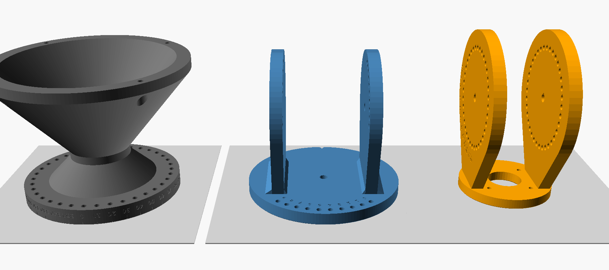

# Indexed alt-az mount — revision 2


An all-printed bench mount for the 400 mm PETAL. Elevation and azimuth each lock with one steel pin through a vernier pair of hole rings, giving a positive stop at **every 1°** (or 2° / 3° — see `step`). No gears, no printed threads, no friction-only settings.

| | |
|---|---|
| Elevation | −5° to 100° (rim ≥ 15 mm above bench at −5°) |
| Azimuth | 360°, continuous |
| Increment | 1° default; `step = 2` or `3` for fewer, beefier holes |
| Lock repeatability | ±0.2° at a 0.3 mm pin clearance (tighter if reamed) |
| Supports | none — no surface steeper than 45°, no bridges |
| Axle height | 229 mm above bench |
| Port | Ø34 clear behind the hub's Ø30 opening |

## Parts

All in `cad/indexed-mount.scad`; default STLs in `cad/STL/` are already in print orientation — load and slice, don't rotate.



| Part | STL | Bed footprint | Prints | Why this way |
|---|---|---|---|---|
| Column | `indexed-column.stl` | 196 × 196 × 139 | **flange down** | azimuth datum and its 36 holes come off the bed flat and round; the base is a hollow 40° trumpet |
| Head | `indexed-head.stl` | 156 × 156 × 148 | disk down | turntable face off the bed; cheeks are in-plane walls |
| Cradle | `indexed-cradle.stl` | 94 × 136 × 168 | hub face down | the face that seats on the PETAL hub is the flattest one you can print |

All three fit a 220 × 220 × 250 bed with 8 mm margin.

## Printability

- **No supports, no bridges.** Every surface is within 45° of vertical. The trumpet base flares at 40°, the flange fillet narrows as it rises, and the bench-screw countersinks are 45°.
- **Teardrop horizontal holes.** The axle and pin holes in the cheeks and ears are round, with a 45° peaked roof pointing at the print's top. The pin still sits in 270° of true circle and can't ride up into the peak, because the peak's mouth is narrower than the pin. Indexing accuracy is unchanged.
- **Only vertical holes on datum faces.** Turntable pin holes, the M8 clamp and the hub M4/port holes all print vertical, so they come out round.
- **Elephant-foot chamfers.** 0.6 × 45° on every bed-side edge and hole entry, so first-layer squish doesn't pinch the holes or lip the datum faces.
- **Engraving only on vertical or top faces.** The azimuth scale is now on the column's flange rim. Engraved digits are 0.6 mm deep, and their stroke tops are the only sub-45° features anywhere, at most 3 mm wide.
- **Load direction vs. layers.** Cheeks, ears and the hub ring carry in-plane loads; the root fillets on the cheeks spread bending at the layer seam.

Run `python3 scripts/check-printability.py cad/STL/indexed-*.stl` on a build with `-D engrave=0` to confirm zero overhang area. With engraving on, it reports only the 0.6 mm letter recesses.

## Hardware

| Qty | Item | Use |
|---|---|---|
| 4 | M4 × 16 socket head + M4 washer | cradle → hub mount inserts (10 mm ring + 1 mm washer = 5 mm insert entry) |
| 2 | M8 × 40 socket head, 2 washers each, M8 nylock | elevation axle, one stub per side |
| 1 | M8 × 35 hex head, fully threaded (DIN 933), washer, nylock | azimuth clamp; head pushed up the column's hex bore |
| 3 | Ø5 × 40 steel clevis pin + R-clip | two elevation locks (one per side; one alone works), one azimuth lock |
| 4 | M5 / #10 **flat-head (90° countersunk)** bench screws | column foot, countersunk holes on a 182 mm circle |

Ø5 × 40 ball-lock quick-release pins are a faster swap for the clevis pins.

## Slicer settings (ASA-GF)

- Hardened nozzle, enclosure, 5 mm brim on the column and head.
- **Walls:** 5–6 on head and cradle so every pin and axle hole is solid perimeter. 4 on the column.
- **Infill:** 30–40% gyroid on head and cradle; 15–20% on the column.
- **Supports:** off. **Ironing:** optional on the column's top rim.
- **Pin holes:** modeled Ø5.3. If a pin rocks or binds, run a 5.0 mm drill through one part at a time. Never drill a mated pair, because that moves the hole.
- **Engraving:** paint-pen wipe, then scrape the face.

## Assembly

1. **Column.** Push the M8 × 35 hex bolt shank-first up through the open base until its head seats in the hex bore under the flange. Set the head on the flange, washer + nylock. Snug until the head turns by hand with a firm, even drag.
2. **Level and orient.** Shim the foot so the head disk is level (this is the 0° elevation reference). Rotate the column until the **0** on its rim faces your azimuth reference (true north, a bench edge), then screw the foot down. Bolt it down — at the horizon the dish's center of mass is forward of the foot.
3. **Cradle on dish.** Hub face against the PETAL's flat rear hub, 4 × M4 × 16 into the mount inserts. Ears clear every root-screw head; the cradle stays on for transport.
4. **Cradle into head.** Lower the ears between the cheeks, M8 × 40 through cheek + ear on each side, nylock on the inside face. Snug so the dish holds its own weight with the pins out but moves with a firm push.
5. **Coax** runs out the Ø34 port, straight back between the ears and out behind the axle. Leave a loop for azimuth travel.

## Setting an angle

Each axis has a coarse scale (every 10°) and ten fine holes labeled **0–9**.

1. Hold the dish, pull the pin.
2. Swing until the pointer sits on the **10s mark at or below** your target — the notch on top of the cheek for elevation, the notch on the head disk's front edge, read against the column rim, for azimuth.
3. Put the pin in the fine hole labeled with your target's **last digit**, and nudge the dish until it drops through. Only that pair lines up; its neighbors are 1° off and the pin won't enter them.

| Target | Coarse mark | Fine hole |
|---|---|---|
| El 37° | 30 | 7 |
| El −4° | −10 | 6 |
| Az 215° | 210 | 5 |


Elevation pins go in from the outside of each cheek, R-clip inside. With `step = 2` the fine holes read 0/2/4/6/8; with `step = 3` the coarse pitch becomes 15° and fine holes read 0/3/6/9/12 (add the fine label to the coarse mark).

## Parameters

`step`, `dish_d`, `dish_fd`, `el_min`, `pin_d` and `pin_fit` are at the top of the SCAD. `dish_d` / `dish_fd` / `el_min` set the column height so the rim clears the bench; the dish standoff (100 mm hub face to axle) is sized so the dish back clears the column by 19 mm at −5° and 27 mm at 0°. Re-run the check after changing anything:

```sh
openscad -o cradle.stl -D 'part="cradle"' -D printing=true cad/indexed-mount.scad   # likewise head, column
python3 scripts/check-indexed-mount.py <stl dir>
python3 scripts/check-printability.py <stl dir>/*.stl   # export with -D engrave=0 for a zero-overhang proof
```

The check reloads the STLs and verifies closed meshes and bed fit, one locking pair at every step on both axes, the actual hole positions by ray-cast, a Ø5.0 pin entering only the labeled pair at sample poses, the hub interface (4 × M4 on 60 BCD, Ø34 port, root-screw band clear), azimuth pin access, and a −5…100° sweep of cradle + dish envelope against head and column.

The sweep uses the hub/shell envelope only. Sweep your feed rods, rim shoes and coax physically before relying on the low end of travel. Larger dishes raise the column past a 250 mm bed and put far more wind load through printed parts; this revision is sized for the 400 mm default.
