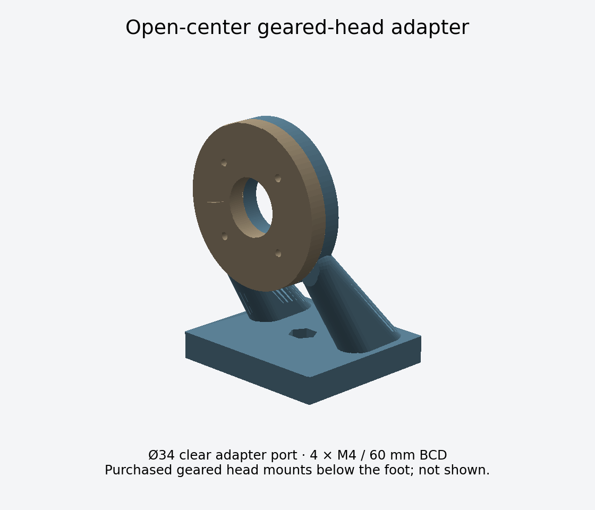

> PETAL 5.0 compatibility: the 60 mm bolt circle remains, but the hub now has 7 mm blind pockets for short M4 inserts. Select screws for 4–5 mm entry after the actual adapter/washer stack. Do not reuse previous screw lengths without checking.

# Manual aiming mount — prototype revision 1

## Recommended first build

Use a purchased **metal geared pan/tilt head**, an open-center PETAL cradle, and a bolt-down bench plate. The head supplies horizontal and vertical handwheel/knob control, bearings, coarse releases and locks. The printed cradle only adapts the dish. Keep the third (roll) axis locked during normal use. This is the shortest route to a useful aiming fixture without making printed gear teeth, printed bearings and the dish's shape retention all untested variables at once.

Reference interface: Manfrotto **410** with its genuine **410PL** plate, a 3/8-inch top screw, and a 3/8-16 base attachment. Verify the physical plate/screw before fabrication; the CAD contains only a ghost envelope for the head, not manufacturer CAD. The manufacturer describes geared movement, coarse release and a nominal 5 kg payload. That camera-payload figure is NOT an allowable dish wind load, overturning moment or qualification of this cradle. A Celestron manual alt-az head is another example of coarse positioning plus slow-motion adjustment, but it needs a different top adapter.

Sources:
- https://www.manfrotto.com/global-en/camera-video-supports/tripod-heads/410-junior-geared-tripod-head-easy-to-use-ergonomic-knobs-410/
- https://www.celestron.com/products/heavy-duty-alt-azimuth-tripod
- https://khkgears.net/pdf/worm-tech.pdf — worm self-locking depends on conditions; do not use presumed self-locking as the sole restraint.

## Files and interfaces

`cad/manual-aiming-mount.scad` is separate from the dish generator. Select `part`, set `printing=true` and export. Default-size STLs are in `cad/STL/`.

- **Hub ring:** Ø94 outside / Ø34 through opening / 10 mm thickness; four Ø4.6 holes at 45°, 135°, 225°, 315° on the existing 60 mm bolt circle. Its front contacts the flat rear hub. This matches the revision-10 bolt circle; the new blind inserts require checking the actual screw stack.
- **Cradle:** another 10 mm annular bearing section, two broadly filleted side struts, and a 100 × 90 × 16 mm foot. The center opening remains Ø34 throughout the adapter, leaving the dish's Ø30 opening accessible. It does not place a pivot shaft, central mounting bolt or gear across that opening.
- **Top interface:** a real 3/8-16 nut in the foot, nominal 14.8 mm across-flats pocket. Do not cut threads in printed plastic. Use the head's genuine quick-release plate and latch, not a printed substitute. The adapter relies on the plate's clamped friction surface; mark it and test for rotation/slip.
- **Bench plate:** 150 × 150 × 6 mm, center Ø9.9 hole and four Ø8.6 holes on a 120 × 120 mm square. Fabricate in aluminum or steel; the STL is a machining/drill reference, not a recommendation to print the permanent load-bearing bench plate. Bolt the four corners to a rigid bench/pedestal. Choose the 3/8-16 center bolt so it engages the actual head fully without bottoming. Account for washers and plate thickness.

The 3/8-inch hardware is imperial UNC; M10 and M8 are not substitutes. The four dish fasteners remain metric M4.

## Assembly and access

1. Assemble and align the complete dish first. Check the rear hub is flat at the adapter contact area. Keep foil, adhesive and burrs off that datum.
2. Add hub ring and cradle using the **four existing mount positions**, not the root screws. Together they add 20 mm to the rear stack. Use flat washers and the blind inserts in the hub. Select screw lengths against the actual stack and insert limits; the generator's unresolved mount lengths are not a shopping list for this adapter.
3. Revision-10 hubs use rear screws into blind M4 inserts. Measure the complete adapter/washer stack and select screw length for 4–5 mm entry into the hub. Never reuse the previous through-bolt stack or bottom a screw in a 7 mm pocket.
4. Attach the genuine geared-head plate to the captive 3/8 nut. Check nut seating, full engagement, clearance, latch capture and twist resistance. The approximately 7.5 mm plastic floor below the nut pocket needs a broad metal plate/washer contact; test for creep or add a metal foot reinforcement before sustained use.
5. Bolt the head to the bench plate, then install the dish. Balance the assembly where the head's plate permits. Route coax through the clear hub or along a feed rod with a flexible service loop. The port is open, but arbitrary feed bodies/connectors are not guaranteed to fit.

The root screws may need the cradle removed for tool access. The four mounting screws make that a reversible operation. Do not enlarge the dish's center hole without revisiting both hub structure and the Cassegrain return-beam calculation.

## Bench height and range

The adapter places the hub center 100 mm above its foot. Measure the actual head height H and pedestal height P. For a horizontal 400 mm dish, require **P + H + 100 ≥ D/2 + 50 mm** as an initial rim-to-bench clearance rule. Then sweep the complete model physically: dish depth, feed, handwheels, cable bend radius and tilted-head geometry also matter. A 100 mm rigid pedestal is a useful initial allowance, not a verified universal dimension. Use a solid/braced pedestal rather than long unsupported printed columns.

Head catalog travel is not the assembled dish's collision-free travel. Do not claim 0–90° elevation until the selected head, pedestal and feed have been swept together. Do not release a coarse clutch while an unbalanced dish can fall; support it by hand. Lock after adjustment.

## Print and physical checks

Hub ring: flat on the bed. Cradle: exported foot-down; inspect supports under the annular arch and on the strut transitions. Use the same dimensionally stable material as the dish, substantial perimeters and locally solid fastener/bearing areas. No generic torque is assigned. For sustained outdoor use prefer a metal cradle/backing structure after the prototype proves the geometry.

Test the unloaded adapter first, then a dummy load, then the dish indoors in still air. Check plate twist, nut pull-through, M4 hub deformation, coarse-release behavior, fine-adjustment backlash, locked drift and warm-load creep at the worst elevation. No payload or wind rating is assigned to the printed adapter. An 800–1200 mm dish needs a separately engineered mount; do not extrapolate the 400 mm prototype from camera weight alone.

## If a fully DIY drive is desired later

A two-axis yoke with opposed stub trunnions can keep the port open. Use metal shafts/bushings, independent locks and either a bought matched worm/wheel pair or spring-preloaded tangent screws. A 1 mm-pitch screw acting tangentially at 100 mm gives about 0.573° per turn near its center; angular sensitivity varies away from the center. Coarse repositioning is needed for a short tangent screw. Printed worm drives would add tooth wear, creep, backlash and alignment risk and are not included as a falsely qualified alternative in this release.
