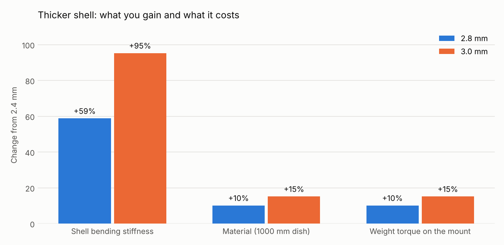
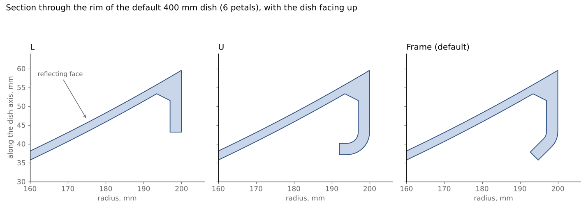
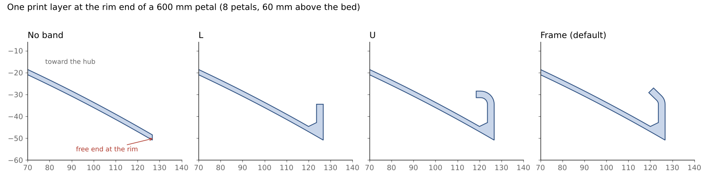
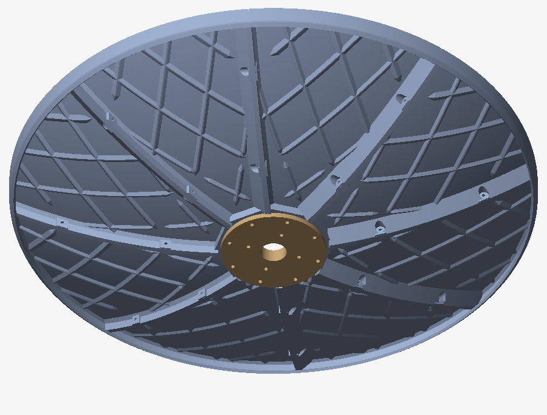

# Printing large petals in ASA-GF, ASA-CF and PCTG

This is a plan for getting long petal prints right the first time in expensive filament. It covers what makes these parts warp, the settings that matter most on the Prusa CORE One L and the Bambu Lab H2D and H2C, what changing the shell thickness, walls or infill would do, and the rim band and ribs that stiffen the petal while it prints.

## What is at risk in this part

PETAL petals print standing on one radial flange. On a large dish that makes them tall, narrow parts:

| Dish / printer | Petals | Largest petal | Bed contact | Contact length |
|---|---|---|---|---|
| 400 mm / 220 bed | 6 × 1 | 174 × 70 × 173 mm | 2,060 mm² | 147 mm |
| 600 mm / CORE One L | 6 × 1 | 274 × 102 × 260 mm | 3,510 mm² | 247 mm |
| 1000 mm / H2D | 10 × 2 | 287 × 125 × 294 mm | 3,400 mm² | 235 mm |
| 1200 mm / H2D | 12 × 2 | 290 × 226 × 300 mm | 4,080 mm² | 266 mm |

Three things follow from this shape:

- **The bed strip is narrow.** The contact averages about 15 mm wide and the part stands up to 300 mm tall, a 20 to 1 ratio. Lifting starts at the two ends of the strip.
- **Every layer is one long curved bead.** Each layer is a slice through the petal's profile, 250–300 mm long. Warping grows with the length of continuous material in a layer (Wang 2007), so this part is near the worst case for it.
- **The prints are long.** A tall part spends hours with its first layers cooling under it while new layers shrink on top, and a single lifted corner or knock ends a 10-hour print.

How much a new layer shrinks against the layers below it is roughly its expansion coefficient times the gap between its glass transition and the chamber. For ASA (Tg about 104 °C, 69 µm/m·°C) that is about 0.55% with the chamber at 25 °C and about 0.3% at 60 °C. Over a 266 mm strip that is a pull of 1.5 mm against the bed at room temperature and 0.8 mm in a 60 °C chamber. Glass or carbon fiber cuts the shrinkage along the bead to about a third (measured on CF-ABS, GF-PETG and CF-PA), but not between layers. That is why ASA-CF and ASA-GF are the right materials for the long petals, and why Prusa's CORE One profile compensates ASA-CF by 0% in XY but 0.22% in Z.

## Settings that matter most

Start from the printer maker's profile for the exact filament. These are the values in those profiles today:

| Profile | Chamber | Bed | Nozzle | Part fan |
|---|---|---|---|---|
| CORE One L · ASA | 60 °C (at least 50) | 110 °C | 260 °C | 20–25% |
| CORE One L · ASA-CF | 60 °C (at least 50) | 110 °C | 260 °C | 15–20% |
| CORE One · PCTG | 35 °C | 85 °C | 260 °C | 30–60% |
| H2D / H2C · ASA | 65 °C | 100 °C | 270 °C | 10–35% |
| H2D / H2C · ASA-CF | 60 °C | 90 °C, textured plate | 275 °C | up to 25% |
| H2D / H2C · PCTG | off | 70 °C | 255 °C | 10–40% |

The CORE One L chamber reaches 60 °C and the H2D and H2C 65 °C; some ASA-GF makers ask for more than either can give, so run them at the maximum.

For the long ASA-GF and ASA-CF petals, in order of importance:

1. **Chamber at the top of its range**, and let it reach temperature before the first layer. This is the setting that does the most against warping.
2. **Dry filament.** Bambu ASA-CF: 80 °C for 8 hours. ASA-GF: 70–80 °C for 4–6 hours. PCTG: 65 °C for 4–6 hours. Keep fiber-filled spools below 20% humidity while printing.
3. **A wide brim.** A 10 mm brim raises the contact of a 170 × 10 mm strip from about 1,700 mm² to about 5,600 mm². Bambu Studio's automatic brim grows with a part's height for exactly this reason. In PETAL, set **Gap between parts** (Print tab) to 16–20 mm so 8–10 mm brims do not merge, or accept merged brims and cut the parts apart afterward.
4. **Plate and glue.** Prusa: smooth or satin sheet with glue stick for ASA. Bambu: Engineering, High-Temp or textured PEI with glue, with the plate type in the slicer matching the plate fitted. PCTG sticks too well: use glue as a release layer.
5. **Low fan and moderate speed.** Keep the part fan at or below the profile's value. Slow down and lower the acceleration for tall parts.
6. **Hardened nozzle.** The H2D and H2C come with hardened steel. On the CORE One L fit a hardened or ObXidian nozzle before printing CF or GF.

## Shell thickness, walls and infill

| Shell | Bending stiffness | Material, 1000 mm dish | Weight on the mount |
|---|---|---|---|
| 2.4 mm (default) | 1.00 | 3.05 L | 1.00 |
| 2.8 mm | 1.59 | 3.36 L (+10%) | +10% |
| 3.0 mm | 1.95 | 3.51 L (+15%) | +15% |

The plate count does not change at any of these thicknesses.

- **Thickness does little for warping itself.** A thicker shell is stiffer, so it bends less once the part comes off the bed. It also has more material shrinking in each layer, so it pulls harder on the bed strip. On balance the two roughly cancel for bed lift.
- **Where 2.8 mm pays off is stiffness in use.** 2.8 mm is 59% stiffer for 10% more filament and print time, and adds 10% to the weight on the mount. That matters most for the longest petals of a large dish, against wind and handling. 3.0 mm costs another 5% for less additional gain.
- **Make the shell all walls.** With 0.45 mm lines, a 2.4 mm shell is five to six walls and a 2.8 mm shell six to seven. Set enough walls that the slicer preview shows only walls across the shell, with no gap fill or infill inside it.
- **Do not use 100% infill.** Infill only fills the thicker parts: the root boss, the bolt pads and the clip walls. Denser infill raises the residual stress, and Bambu's guidance is to stay under 50%. Use 15–25% gyroid there and more walls instead.

## Rim band and underside ribs

Every layer of a side-printed petal is one long curve that ends at the rim. That end is a free 2.4 mm edge standing up to 300 mm tall, so it flexes when the nozzle reaches it and turns around, and the layer lands slightly off. **Rim band** (Shape tab) puts a wall behind the rim of each outer petal, square to the dish, so that every layer ends in a hook instead:

| Band | Section | Extra material, 600 mm petal |
|---|---|---|
| None | free edge | — |
| L | 3 mm wall, 14 mm deep, 45° fillet to the shell | +8% |
| U | the wall, then a round 90° bend toward the hub and a 2 mm lip | +12% |
| Frame (default) | the wall, then a round 45° bend toward the hub and a 5 mm lip | +12% |

- The band's end face sits on the bed with the flange, so the bed contact becomes an L at the end of the strip, where lifting starts.
- Assembled, the bands of all the outer petals form one frame around the dish, which also stiffens the rim in use.
- The wall depth is adjustable (6–30 mm); a U or frame foot adds about 6 mm behind it.
- The wall stays square to the dish with any petal count. With 6 petals its inner face reaches 60° from vertical near the top of the side print (45° with 8 petals, less with more). It is a short face on the hidden inside of a thick wall and prints without support; expect a slightly rougher surface there.
- Seam stations near the rim move toward the hub just far enough to keep their bolts, clips or levers clear of the band. A short seam that would crowd its stations loses one.

**Underside ribs** (Shape tab, off by default) add a diamond grid of low ribs, 2.5 mm tall and 50 mm apart by default, across the underside of every petal. Their 45° sides print without supports in any direction, they stop short of seam hardware and the rod socket, and the grid is mirrored on each petal so the ribs meet the next petal's at the seams. On a 600 mm, 8-petal dish they add about 8% material.

## Annealing

- **ASA and ASA-CF:** skip it. Prusa's tests found almost no strength gain for ASA and bad warping from 110 °C. Bambu allows 80–90 °C for 6–12 hours for its ASA-CF but warns that larger parts can deform.
- **PCTG:** never. It softens from about 64–76 °C, so a 2.4 mm shell would sag.

## A test plan that wastes the least filament

1. Print the two seam strips (`FIT_TEST/seam-strip-print-two.stl`) in the real material and settings. Check that the mating faces sit flat and the hardware fits.
2. Print one of the longest petals alone, with the brim, at the settings above. After it cools, check the bed strip and the seam faces with a straightedge, and compare the two flanges' lengths.
3. Only then print full plates. For the first runs in a new material, put fewer petals on a plate: a part that lets go can knock over the ones nested next to it.

## Sources

- Polymaker, warping: https://wiki.polymaker.com/printing-tips/material-science/warping and https://wiki.polymaker.com/printing-tips/common-printing-issues/warping
- Stratasys ASA data sheet (Tg, CTE): https://pocc.techpark.uconn.edu/wp-content/uploads/sites/2880/2020/10/MDS_FDM_ASA_0920a.pdf
- Residual strain in printed ABS and anisotropic expansion of CF-PA: https://www.ncbi.nlm.nih.gov/pmc/articles/PMC11433601/
- Expansion of CF-ABS and GF-PETG along and across the bead: https://www.ncbi.nlm.nih.gov/pmc/articles/PMC9031978/
- Infill density and residual stress (simulation): https://pmc.ncbi.nlm.nih.gov/articles/PMC10347020
- Continuous length and warping (Wang 2007, "bricking"): https://www2.uned.es/egi/publicaciones/congresos/Bricking_A_new_slicing_method_to_reduce_warping.pdf
- PrusaSlicer profiles: https://github.com/prusa3d/PrusaSlicer/tree/master/resources/presets/prusa-research-fff/PrusaResearch
- Bambu Studio profiles: https://github.com/bambulab/BambuStudio/tree/master/resources/profiles/BBL/filament
- Bambu chamber temperature: https://wiki.bambulab.com/en/software/bambu-studio/chamber-temperature
- Bambu warping and plates: https://wiki.bambulab.com/en/filament-acc/filament/print-quality/warping-falling-off-collapsing
- Bambu automatic brim: https://github.com/bambulab/BambuStudio/blob/master/src/libslic3r/Brim.cpp
- Prusa ASA and satin sheet: https://help.prusa3d.com/article/asa_5078 and https://help.prusa3d.com/article/satin-steel-sheet_196526
- Prusa nozzles for abrasive filament: https://help.prusa3d.com/article/prusa-nozzle-types-for-nextruder-printers_928993
- Prusa annealing tests: https://blog.prusa3d.com/how-to-improve-your-3d-prints-with-annealing_31088/
- Bambu ASA-CF data sheet (third-party mirror): https://www.lesimprimantes3d.fr/dl/Bambus_ASA-CF_Technical_Data_Sheet.pdf
- Siraya ASA-GF: https://siraya.tech/pages/siraya-tech-asa-gf-filament-user-manual
- PCTG data sheet (heat deflection): https://nexa3d.com/wp-content/uploads/2024/07/TDS-Essentium-PCTG.pdf
- Spectrum PCTG guide: https://shop.spectrumfilaments.com/Material-Guide-PCTG-blog-eng-1760884613.html
