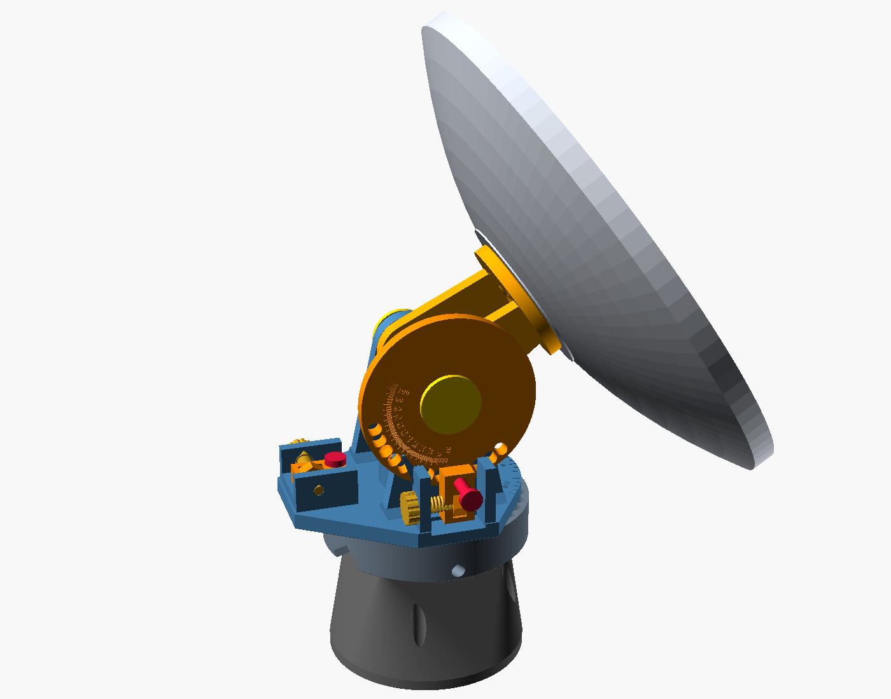
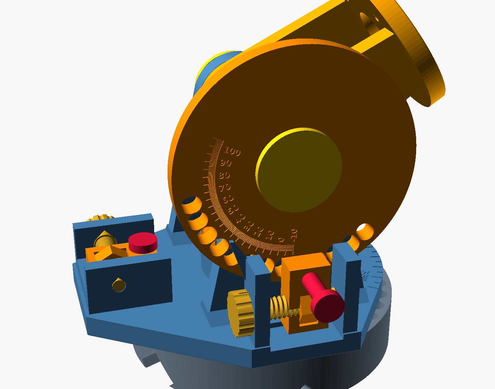
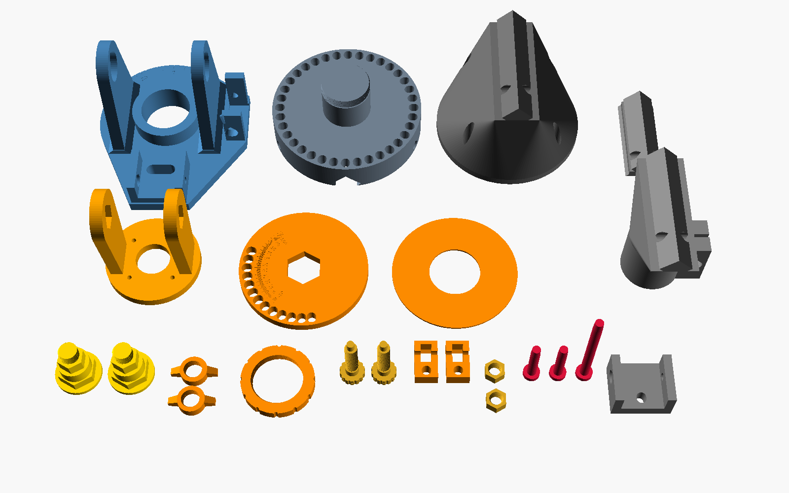

# Pin-and-screw alt-az mount



An all-printed aiming mount for the 400 mm PETAL. It has no gears. Each axis works the same way:

- **Coarse:** a tapered pin drops into a hole every 10°.
- **Fine:** that pin rides in a nut block, which a captive printed screw moves ±9 mm.

Turn the knob and the dish follows. Stop turning and it stays put.

**Design rule:** nothing that holds the dish relies on friction or bolt preload. The load path is:

1. dish
2. pin
3. nut block
4. self-locking screw thread
5. housing walls

There are no clamps to tighten, no springs and no detents. The only metal is the 4 × M4 screws into the PETAL hub's existing inserts.

| | |
|---|---|
| Elevation | −5° to 100° (pinnable −9° to 109°) |
| Azimuth | 360°, continuous |
| Fine adjustment | **2.6° per knob turn (elevation), 2.0° (azimuth)**. 8 ticks per turn, so 0.32° / 0.26° per tick |
| Travel per hole | ±9.2° elevation, ±7.4° azimuth. Holes are 10° apart, so neighboring ranges overlap and every angle is reachable |
| Readout | 1° scales: elevation on the index wheel, azimuth on the yoke flange |
| Hold | Screw lead angle 4.1°. Friction angle is about 17° at μ 0.2 on the 48° flanks, so it can't back-drive. |
| Interface | Dovetail rail plus lock pin. Mounts: bench riser, Arca-Swiss plate, 1-1/4" pipe clamp |
| Supports | None. No surface steeper than 45° and no flat ceilings, engraving included |

The two axes share **one drive set**: screw, nut, nut block and index pin. A spare of each fits either axis.

## How it works



### Elevation
The cradle bolts to the hub and turns on two printed trunnion pins in the yoke arms.

- **Index wheel:** keyed to the right trunnion pin by a hex. It turns with the dish and has holes every 10°.
- **Drive:** a housing on the yoke sits just outside the wheel, below the axle. The pin goes through the nut block into a wheel hole.
- **Fine adjustment:** turning the knob slides the block, which turns the wheel and the dish.

### Azimuth
The yoke turns on a Ø50 spindle that rises from the base. A PCTG washer sits under it and a threaded keeper ring holds it on top.

- **Drive:** at the rear of the yoke, the pin goes down through the nut block and a slot in the yoke flange into one of 36 holes in the base.
- **Fine adjustment:** turning the knob slides the block, which swings the yoke around the base.

### The pin and taper
- The block moves in a straight line while the hole moves on an arc. Each seat is 0.7 mm oblong in the radial direction to absorb that.
- Along the direction of travel, the 1:9 taper sets the fit.
- Push the pin home and it binds about 1 mm past first touch. All tangential play is gone.

## Parts

STLs are in `cad/STL/` (`screw-*.stl`), already in print orientation. Load them and slice without rotating.



| Part | Qty | Material | Prints | Footprint (mm) | Notes |
|---|---|---|---|---|---|
| `screw-yoke` | 1 | ASA-GF | flange down | 156 × 179 × 126 | Arms, both drive housings, azimuth scale |
| `screw-base` | 1 | ASA-GF | flat | 156 × 156 × 74 | Spindle, 36 azimuth seats, rail channel |
| `screw-cradle` | 1 | ASA-GF | hub face down | 94 × 94 × 116 | Bolts to the PETAL hub |
| `screw-index-wheel` | 1 | ASA-GF | inner face down | 128 × 128 × 10 | Elevation seats and scale |
| `screw-trunnion-pin` | 2 | PCTG | head down | 44 × 44 × 51 | Same part both sides |
| `screw-trunnion-nut` | 2 | PCTG | flat | 44 × 26 × 10 | Wing nut, hand tight |
| `screw-keeper` | 1 | PCTG | flat | 70 × 70 × 10 | Holds the yoke on the spindle |
| `screw-washer` | 1 | PCTG | flat | 125 × 125 × 2 | Azimuth thrust bearing |
| `screw-screw` | 2 (+1) | PCTG | knob down | 24 × 24 × 64 | +1 for the pipe clamp |
| `screw-nut` | 2 (+1) | PCTG | flat | 18 × 21 × 10 | +1 for the pipe clamp |
| `screw-nut-block` | 2 | PCTG | flat | 22 × 38 × 14 | |
| `screw-index-pin` | 2 | PCTG | head down | 16 × 16 × 53 | Elevation and azimuth |
| `screw-lock-pin` | 1 | PCTG | head down | 16 × 16 × 107 | Locks the base on its mount's rail; brim it |
| `screw-riser` | 1 | ASA-GF | foot down | 150 × 150 × 113 | Optional bench stand: puts the axle 228 mm above the bench |
| `screw-arca-plate` | 1 | ASA-GF | dovetail down | 38 × 90 × 28 | Optional: clamps in any Arca-Swiss clamp |
| `screw-pipe-adapter` | 1 | ASA-GF | bore down | 77 × 124 × 115 | Optional: 1-1/4" NPS mast (42.2 mm OD) |
| `screw-coupon` | 1 | either | flat | 56 × 46 × 32 | **Print first.** One housing and one seat |

**Why two materials:**
- **ASA-GF** carries the structure, where stiffness matters.
- **PCTG** goes on everything that slides, threads or takes a shock load. It's tougher and wears better against the glass-filled parts than ASA-GF does against itself.

## Hardware

| Qty | Item | Use |
|---|---|---|
| 4 | M4 × 16 socket head + washer | cradle → PETAL hub mount inserts |
| 4 | #10 / M5 flat-head wood screws | riser → bench (optional) |

That's all of it.

## Print settings

- **Nozzle and bed:** hardened nozzle for ASA-GF; enclosure; brim on the yoke, base and riser.
- **Elephant foot:** turn on the slicer's elephant-foot compensation (about 0.2 mm). The parts already have 0.6 mm foot chamfers, but the threads and seats need the first layer true.
- **Walls:**
  - 5 on the screw, pins and trunnion pins
  - 4–5 on the yoke, base and cradle
  - 3–4 on the riser and adapters
- **Infill:**
  - 40–50% on the pins and trunnion pins
  - 30% gyroid on the yoke, base, cradle and wheel
  - 15–20% on the riser
- **Supports:** off.
- **Threads:** print screws and nuts one at a time at 0.12–0.16 mm layers.

## Assembly

1. **Coupon.**
   - Print `screw-coupon` and one each of screw, nut, nut block and index pin.
   - Check that the nut drops into the block and the screw threads the nut.
   - Check that the block slides end to end.
   - Check that the pin goes through the block into the seat and binds firmly with no rocking.
   - If anything is tight, adjust your slicer's hole compensation before printing the rest.
2. **Base on a mount.** Slide the base's channel onto the riser, Arca plate or pipe adapter rail. Push the lock pin in from the side of the base, through the cross hole, until its head touches the rim.
3. **Yoke on the base.**
   - Washer over the spindle, then the yoke, flange down.
   - Thread the keeper ring onto the spindle until it touches, then back it off a few degrees.
   - The yoke should turn freely with no rocking.
4. **Cradle on the dish.**
   - Hub face against the PETAL hub, 4 × M4 × 16 into the mount inserts.
   - The plate stays inside the root-screw heads, and the Ø34 port stays open for the coax.
5. **Cradle into the yoke.**
   - Lower the cradle cheeks between the yoke arms.
   - Right side: slide the index wheel onto a trunnion pin's large hex, scale facing out. Push the pin through the right arm into the cheek's small hex.
   - Left side: push the other trunnion pin straight in. Its large hex just acts as a collar there.
   - Thread a wing nut on each pin inside the cheek, hand tight.
6. **Drives (same on both axes).**
   - Drop a nut into a nut block's slot, then the block into the housing.
   - Feed the screw through the knob-side wall and turn it through the nut until the nose enters the far wall.
   - The knob and the thread shoulder trap the screw between the two walls, so it can't walk in either direction.
7. **Pins.**
   - Turn each knob to about mid-travel.
   - Swing the axis by hand until a hole lines up under the block, then push the pin in until it binds.

## Using it

- **Big moves:**
  - Pull the pin and swing the dish by hand to within a few degrees of the target.
  - Turn the knob until the block's hole lines up with the nearest seat, then push the pin home.
- **Fine moves:** turn the knob.
  - Elevation: one turn is 2.6°.
  - Azimuth: one turn is 2.0°.
  - Peak on your meter, then leave it. There's nothing to lock afterwards.
- **Running out of travel:** if a block reaches the end of its slot, pull the pin, center the block, re-pin in the next hole and carry on. Neighboring holes overlap by at least 0.8° on elevation and 4.8° on azimuth.
- **Reading angles:**
  - Elevation: read the index wheel at the pointer blade on the yoke.
  - Azimuth: read the flange scale at the groove on the front of the base.
  - Level the base first. Turn the azimuth scale to your reference, then rotate the mount to match.
- **Coax:** it exits the Ø34 port and runs down behind the yoke. Azimuth has no stop, so don't wind more than one turn either way.

## Loads

Each kilogram of dish and feed at a 135 mm center-of-mass offset puts about 24 N on the elevation pin and screw at the horizon. That gives:

- **Pin shear (Ø9):** about 0.4 MPa per kg.
- **Thread bearing:** about 0.2 MPa per kg over the nut's four engaged turns.
- **Hub screws:** about 10 N of tension per kg on the upper pair.

These are small numbers on purpose. The limit for a printed part sitting loaded for days is creep, not strength, which is why the drift test below matters more than the arithmetic.

## Validation

To export the STLs, run this for each part:

```
openscad -o <part>.stl -D 'part="<part>"' -D printing=true cad/screw-mount.scad
```

Two scripts check the result, and both exit nonzero on any failure.

### `scripts/check-screw-mount.py <stl dir>`
It reloads the STLs, places them with the same transforms as the SCAD, and checks:

- **Bed fit:** closed single-body meshes that fit 220 × 220 × 250.
- **Coverage:** every elevation from −5° to 100° and every azimuth, at 0.25° steps, has a hole inside the screw travel and the seat's radial slack.
- **Free running:**
  - Both screws turn in their housings.
  - Both blocks reach ±9 mm without touching.
  - The nut fits the block.
- **Threads:** the printed nut, keeper ring and trunnion nut each find a clear phase on their mating threads.
- **Trunnion stack:** cradle, trunnion pins, wheel and nuts clear the yoke at 0°, 45° and 100°. The yoke clears the spindle and washer.
- **Pin seating** at three elevations and three azimuths, including off-center screw positions:
  - The pin is clear at nominal depth.
  - The taper binds after 0.99–1.10 mm more push.
  - It binds on the taper flank, not by bottoming.
- **Elevation sweep:** −9° to 109° in 2° steps. Cradle, trunnion parts and the dish envelope clear the yoke, base, housings, blocks and screws.
- **Azimuth sweep:** 0–345° in 15° steps at −9°, −5°, 0°, 30° and 90° elevation. Nothing that turns touches the base or riser.
- **Bench clearance:** the rim stays 15 mm above the bench at −5° and 5 mm above it at −9°.
- **Rail lock:** the lock pin slides through the base and the riser's rail and crosses the full rail width.
- **Hub interface:** 4 × M4 on the 60 mm circle, the Ø34 port, and the root-screw head band.

### `scripts/check-printability.py *.stl`
It scans every part for downward faces steeper than 45° and for flat ceilings. All 17 parts pass with engraving on.

### Limits
These are geometry checks, not a test of the printed part. They don't model:

- print tolerance
- thread friction
- creep
- wind

The dish envelope covers the shell and hub only. Check feed rods, rim shoes and coax by hand at the ends of travel.

## Physical tests before trusting it outdoors

1. **Coupon fit** (assembly step 1).
2. **Pin bind.**
   - Push a pin home in the coupon and try to rock the block along the screw axis.
   - You should feel nothing until the screw turns.
   - Re-seat it 10 times and confirm the bind stays consistent.
3. **Drift test.**
   - Mount the dish at 0° elevation, where the moment is largest.
   - Tape a laser pointer or phone inclinometer to the rim.
   - Leave it 48–72 hours somewhere warm (a sunny window or garage), then read it again.
   - Repeat at 45° azimuth to load the azimuth pin sideways.
   - Anything under 0.2° is below one knob tick.
4. **Tap test.**
   - Tap the dish rim lightly 20 times.
   - The horizontal elevation pin is held in only by its taper fit, so confirm it doesn't walk out.
   - If it does, a rubber band or printed clip over the pin head fixes it.

## Compared with the geared head

| | Geared head (`GEARED-MOUNT.md`) | Pin and screw (this) |
|---|---|---|
| What holds the dish | Worm teeth (about 4 MPa) | Pin in shear, then the screw thread |
| Backlash | Tooth and worm clearance | Taken out by the taper |
| Fine step | 0.5° per tick | 0.26–0.32° per tick |
| Big moves | 15 turns per 90° | Pull the pin and swing |
| Precision-critical prints | Two worms plus gear teeth | One screw and nut design, used on both axes |
| Metal | M8 and M5 bolts, nylocks, inserts | 4 × M4 into the hub only |
| Weak point | Tooth creep and wear under steady load | The elevation pin is retained only by its taper fit |
