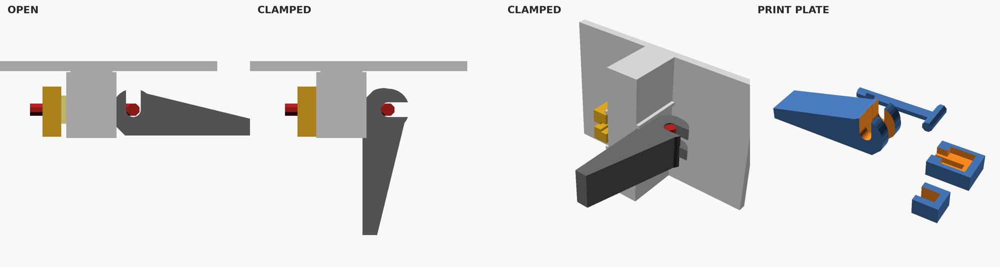

# Seam lever (quick-release, screwless)

A cam-lever clamp for seam stations. Flip the handle down to clamp, flip it out to release. No screws. Use bolts where a seam should be permanent.

In the app, choose **Seam fastening → Seam levers**. The petals get the same stations as **Both** (bolt hole, clip window, guide ridges), and the kit includes a lever, draw bar, keeper and spring for every station plus spares, sized to the selected **Seam bolt size** (M3 or M4 holes). The assembly view shows each set installed. At ring junctions where a neighboring flange is in the way, the set is turned to the other side of the seam; if neither side has room, that station takes a bolt, and the hardware list says how many. TPU springs are packed on their own print plates.

| | |
|---|---|
| Parts | Lever, draw bar, keeper (PCTG), spring (TPU 95A, or disc/coil springs in the same 7 mm pocket) |
| Stations | Seam joint **Both**: 5 mm flat walls, clip window, guide ridges 10.8 mm apart, bore 2.2 mm below station level |
| Holes | `STL/seam-lever-M3` fits the Ø3.4 holes cut with **Seam bolt size M3**; `STL/seam-lever-M4` fits the Ø4.5 holes cut with **M4** |
| Action | About 1.1 mm draw, a 0.3 mm over-center hump, then the cam seats on a flat; clamp load pushes it further closed |
| Supports | None. Overhang scan finds no face steeper than 45° off the bed |

## Install

1. Push the bar through both flange holes from the lever side.
2. Slide the keeper, with its spring, up onto the bar's neck from behind the dish.
3. Push the lever's open slot up onto the bar's cross pin with the handle sticking straight out.
4. Flip the handle down along the flange.

Release in reverse: handle out, drop the lever off the pin, slide the keeper down.

## Printing

Print the STLs as oriented, at full scale (the bar is sized to the hole).
- **Lever:** stands on its clamping flat; the pin slot opens upward.
- **Bar:** flat on the bed, so the shaft and pin run along the extrusion lines.
- **Keeper:** back face down, pocket up.
- **Spring:** tune clamp force with TPU walls/infill or `spring_t`, not the cam.

## Strength

Ballpark only, not a rating: the M3 bar neck is about 4 mm² (around 150 N ultimate in PCTG); M4 is roughly double. Intended for many stations sharing the load as a quick-assembly option.

## Changing it

`cad/seam-lever.scad` takes the station geometry from the generator (`wall`, `hole_d`, `hole_y`, `ridge_gap`, `shell_y`) and derives the bar, cam and keeper from it. Tuning values: `stroke`, `hump`, `pre`, `spring_t`, `pocket`, `handle_l`. Export a part with `-D 'part="lever"'` (or `bar`, `keeper`, `spring`, `plate`); `part="assembly"` with `closed=true|false` shows it on a mock station, and `installed_*` gives each part in its clamped pose in the station frame. After changing the SCAD, run `python3 scripts/pack-lever.py`: it re-exports both STL sets and the meshes bundled into the app (`dist/lever-meshes.js`).
