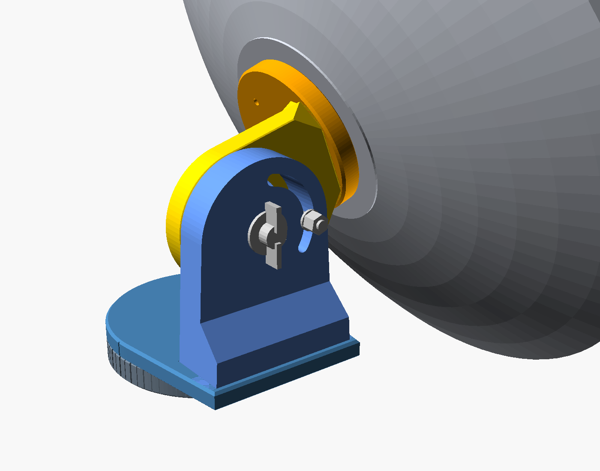
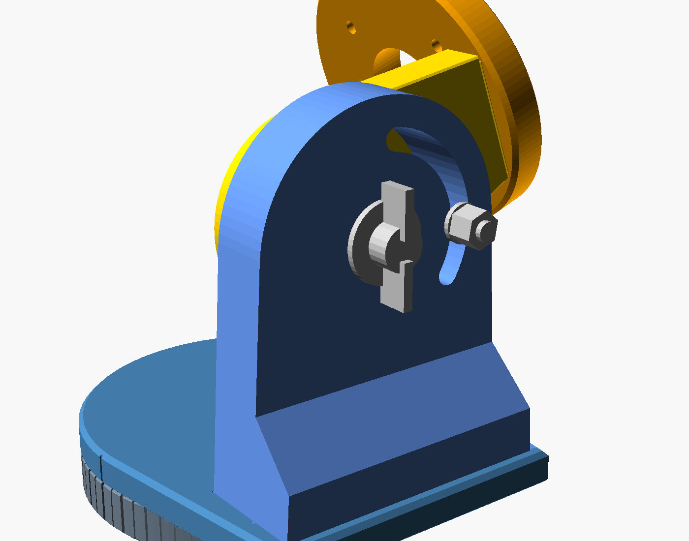
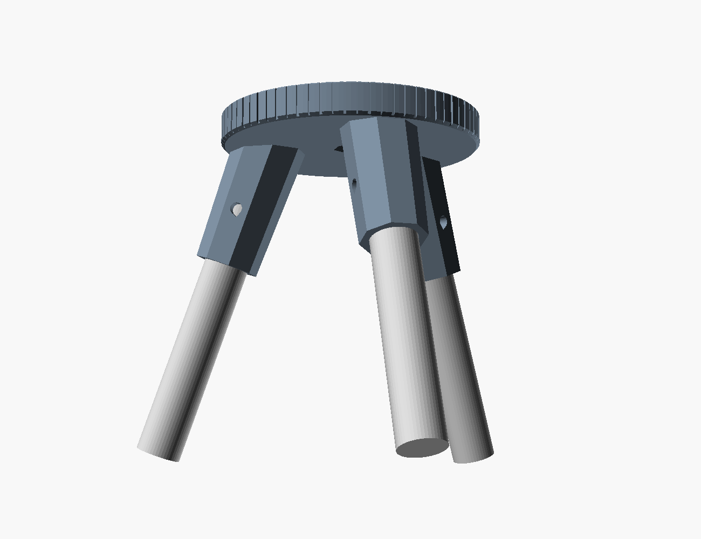
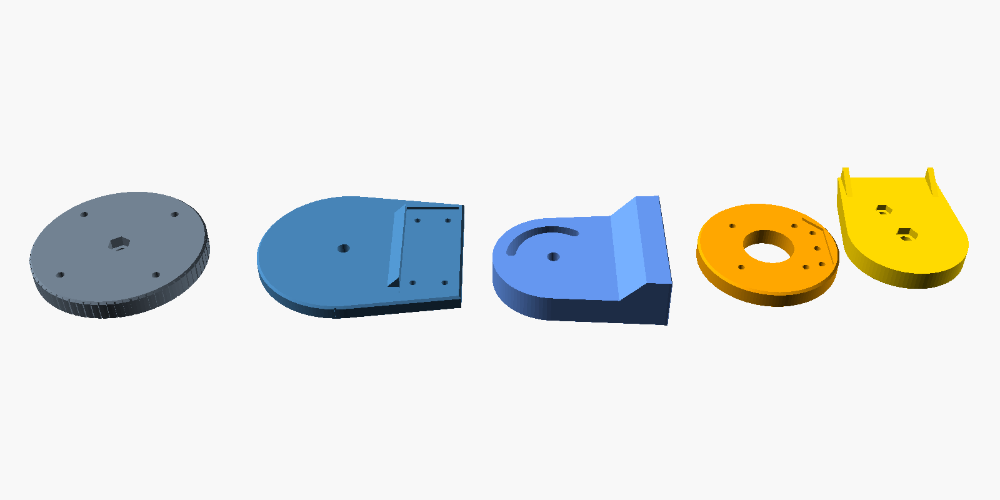
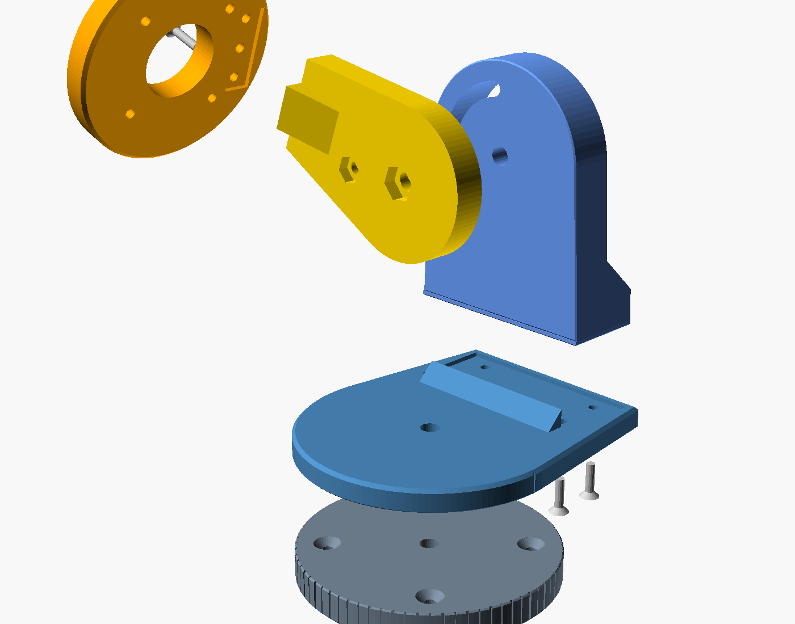

# Simple alt-az mount

Five printed parts and one clamp per axis. Each clamp is two flat faces squeezed by one bolt (M8 by default): loosen, aim, tighten. The two arms, the upright and the cheek, are separate parts bolted on with heat-set inserts (M4 by default). Every bolt size can be changed; see [Bolt sizes](#bolt-sizes). That lets every part print flat, with no supports.

| | |
|---|---|
| Parts | Base, yoke, upright, cradle, cheek. Without the base: four parts |
| Azimuth | 360°. The yoke turns on the base; one bolt in the center, tightened with a hex key from above |
| Elevation | −10° to 100°, checked with the dish fitted. The cheek clamps against the inside of the upright, with one wing nut. Optional arc lock: a second bolt in an arc slot |
| Scale | Azimuth grooves down the base rim every 5°, wide every 10°, read at the groove on the back of the yoke |
| Joints | Upright → yoke plate: 4 flat-heads from below. Cheek → cradle plate: 3 flat-heads from the hub face. All into heat-set inserts, heads flush |
| Mounting | 4 flat-heads through the base, through the yoke plate without the base, or three legs in the tripod base |
| Supports | None. The overhang scan passes for every part; inspect your slicer toolpath |

## Options

Set them in PETAL under **Aiming mount**, or in `cad/simple-mount.scad`:

| App setting | SCAD parameter | Effect |
|---|---|---|
| Azimuth base: *Printed base with azimuth scale* (default) | `stand_holes = false` | Base + yoke turntable with the azimuth clamp and the scale |
| Azimuth base: *No base · turntable bolts to the stand* | `stand_holes = true` | No base part. The yoke plate gets 4 countersunk M5 holes from its top and screws straight onto a flat stand. No azimuth clamp: turn the stand to aim in azimuth |
| Azimuth base: *Tripod leg sockets* | `base_screws = false`, plus sockets added by the app | The base without its M5 holes, with three splayed, tapered leg sockets on its underside. See [Tripod base](#tripod-base) |
| Elevation lock: *Add arc-slot lock bolt* | `arc_lock = true` | An M6 bolt runs in an arc slot through the upright, from a captive head in the cheek, for extra grip. It covers the whole −10° to 100° range |

### Bolt sizes

| App setting | SCAD parameter | Sizes (default) | What changes |
|---|---|---|---|
| Clamp bolts | `clamp_m` | M6, **M8**, M10 | Azimuth hole and captive nut pocket in the base; elevation holes and the head pocket in the cheek. Azimuth M × 25 socket head; elevation hex bolt 40 mm (M6, M8) or 45 mm (M10) |
| Joint screws | `joint_m` | M3, **M4**, M5 | Countersinks in the yoke and cradle plates; insert pilots in the upright and cheek (Ø4.2 / 5.6 / 6.4). Flat-heads 14 / 16 / 16 mm (upright) and 16 / 18 / 18 mm (cheek) |
| Stand screws | `stand_m` | M4, **M5**, M6 | Countersunk holes in the base or, without the base, the yoke plate |
| Hub to mount (Connections tab) | `hub_m` | M3, **M4**, M5 | The four cradle holes, matching the hub's mount bolts |
| Leg cross bolt | (app only) | **Auto**, M3–M6 | Auto picks M3, M4 or M5 by leg diameter. The hole may take up to half the leg diameter |

The arc lock stays M6. The insert pilots follow the **Insert pilot** setting, which is the M4 value; M3 and M5 move by the same amount.

The STLs in `cad/STL/` are the default sizes. For other sizes export the parts from the app, or set the parameters above in the SCAD.

## Generator integration

Enable **Aiming mount** in PETAL 5.3. The app embeds blank parts for the selected options (`cad/STL/blank/`, exported with `fasteners = false`) and cuts every bolt hole, countersink, insert pilot and nut or head pocket for the selected sizes, with the SCAD's own transforms and 32-sided holes ([`dist/mount-fasteners.js`](../dist/mount-fasteners.js)). At the default sizes the result matches `cad/STL/simple-*.stl` to float rounding. It applies the same assembly transforms in the viewer/PDF/SCAD snapshot, includes mount parts in plate packing, and checks printed-part interference at the selected pose. It reports the clearance below the lowest mount face at that pose and the geometric minimum stand height across the displayed elevation range. Add stand/cable/handling margin. The stand, hardware envelopes and complete collision sweep are not runtime-certified.

For **blind hub inserts**, use M4 × 18 through the 12 mm cradle with a 1 mm head washer, nominal 5 mm entry (M3 × 16 and M5 × 18 for the other sizes). Never use the through-bolt length in a blind insert. For **through bolts**, use the generated schedule; M4 × 35 is the default 400 mm setup.

The kinematic frame is the same for every option: elevation axis 94 mm above the base bottom (base 14 + yoke plate 10 + 70), hub face 75 mm ahead of the axis, clamp faces at x = 40. Without the base the yoke bottom, 14 mm up in that frame, is the lowest face, and the app measures stand clearance from it.

## Design choices

- **One adjustment per axis.** Elevation is a single clamp on one side. It's asymmetric on purpose, so there's one wing nut to work instead of two.
- **Split arms for print orientation.** The upright and the cheek print lying on their clamp faces. The clamp faces come out flat, both elevation bolt holes and the arc slot are vertical in the print, and the layers run along each arm, the way the dish bends it. The plates print on their bearing faces.
- **Bolted joints that resist the moment both ways.** The upright stands on the yoke plate on 4 screws: two under the arm itself (x 48) and two in a foot flange on its outer side (x 69), 64 mm apart. The dish's weight tips the upright inward, which loads the flange screws, and anything that tips it outward loads the inner pair. A low shoulder on the plate locates the upright's inner face. The large triangular flare of the one-piece yoke is gone.
- **Inset joints.** Each arm ends in a 2 mm tenon that drops into a matching pocket in its plate, with 0.2 mm clearance per side and a 0.5 mm lead-in. The tenon locates the arm and carries sideways shear, so the screws only clamp.
  - The upright's tenon is its whole footprint, foot flange included, and it bears on the pocket floor.
  - The cheek's tenon stands 2 mm inside its end face on the inner, top and bottom sides, and is flush with the clamp face so it prints without overhang. The tenon end and the end face both bear on the plate.
  - The insert pilots are 2 mm deeper, so the screws keep their length and full engagement.
- **Cheek gusset.** One solid wedge (20 mm wide, 8 × 24 mm) on the cheek's inner face at the plate end stiffens the joint and bears on the plate. It sits between the hub's bolt heads and outside the Ø34 port, and prints as an up-facing slope.
- **Countersunk heads, no bridges.** All joint and stand screws are 90° flat-heads. The countersinks open toward the bed, so their 45° cones print without support where a counterbore would need bridging. The heads finish flush or just below the face: under the yoke plate that is the azimuth bearing face, and on the cradle it is the face the dish hub bears on.
- **Clamp faces sized to the load.** The upright's cap is r 40 around the axis and holds the arc slot. The cheek's clamp disc is r 32, about 37 cm² of contact. Hand-tight on the default M8, that holds roughly 8 N·m, several times the moment of a 400 mm dish with a feed in wind.
- **A compact cheek.** The cheek tapers straight from its clamp disc to a flat 14 × 42 mm end face. The whole face sits inside the plate's rim chamfer, so it needs no corner cuts, and it clears the four hub bolt heads behind the plate. It is 70 cm³, about 30% less than the earlier 80 mm wide cheek with ribs.

## Tripod base

Pick **Tripod leg sockets** as the azimuth base, enter your leg diameter (8–25.4 mm, in mm or inches) and set the splay with its slider (10–30° from vertical, default 20°). Legs are whatever round stock you have: dowel, aluminum tube or conduit.

| | Rule | 20 mm legs, 20° splay |
|---|---|---|
| Bore | leg Ø + 0.4 mm, blind, floor just below the base | Ø20.4 |
| Engagement | max(35 mm, 2.5 × leg Ø) | 50 mm |
| Wall | max(5 mm, 0.25 × Ø) at the base, tapering to max(3 mm, 0.15 × Ø) at the mouth | 5 → 3 mm |
| Shape | Octagon, flats facing the cross bolt | 30.4 → 26.4 mm across flats |
| Cross bolt | Auto: M3 below Ø14, M4 below Ø20, M5 above; or pick M3–M6. Mid-engagement, nyloc and two washers | M5 × 40 |
| Placement | As far out as the Ø116 disc allows, clear of the azimuth nut | root at r 37 mm |

Leg 1 points along azimuth zero. Each socket's flats face the tangential direction, so the cross bolt clamps two flat faces. Push the leg home, drill it through the socket hole, and bolt it.

**Printing.** The base still prints top face down, so the sockets stand up from it, leaning out by the splay. The outer faces overhang by at most the splay plus about 2° of taper. The bore floor faces up and the cross-bolt holes are teardrops. No supports.

**Leg length.** The app computes the shortest legs that do two jobs, for your actual dish, feed and mount:

- **Stability.** It sums every printed part, the aluminum rods and mast, and the feed payload at its focus, and finds the worst center-of-mass offset from the azimuth axis over the elevation range. A tripod tips first over the edge between two feet, which sits at half the foot radius. The legs must put that edge 1.5 times farther out than the offset.
- **Ground clearance.** The dish's lowest point over the elevation range must stay 20 mm off the ground.

The default 400 mm dish needs 370 mm legs at 20° splay, on a 334 mm foot circle. With the Gregorian collector the center of mass moves forward and the answer becomes 560 mm. More splay shortens the legs.

**Leg clearance.** The dish turns in azimuth over fixed legs. For every elevation the app checks whether any part of the dish comes within 3 mm of a leg or socket at any azimuth, and reports the lowest elevation that is clear all the way round. It also checks the selected pose exactly. The default dish touches a leg only below −8°, and only when it faces that leg.

These are static checks with no wind rating. Stake or weight the feet outdoors.

## Parts

STLs are in `cad/STL/`, already in print orientation, at the default bolt sizes. Use the variant that matches your options.

| Part | STL | Prints | Size (mm) |
|---|---|---|---|
| Base | `simple-base.stl`; tripod: export from the app | Top (clamp) face down | Ø116 × 14; tripod about 127 × 128 × 70 |
| Yoke | `simple-yoke.stl`; without the base `simple-yoke-stand.stl` | Bearing face down | 138 × 116 × 18 |
| Upright | `simple-upright.stl`; with arc lock `simple-upright-arc.stl` | Lying on its clamp face (x = 40) | 110 × 88 × 36 |
| Cradle | `simple-cradle.stl` | Hub face down | Ø94 × 12 |
| Cheek | `simple-cheek.stl`; with arc lock `simple-cheek-arc.stl` | Lying on its clamp face (x = 40) | 97 × 64 × 22 |

The cradle keeps the hub interface: Ø94 × 12 plate, Ø34 port, 4 holes on a 60 mm circle for the hub's mount bolts (M4 by default).

**Material:** use a qualified ASA or reinforced ASA profile for the rigid mount parts, with slip and warm-creep tests. This is separate from the flexible clip material; filled filament is not automatically suitable for repeatedly flexed snaps.

**Print settings:**
- 5–6 walls.
- 30–40% infill.
- Elephant-foot compensation on.
- Insert pilots are 10 mm deep blind holes (Ø5.6 for M4, Ø4.2 for M3, Ø6.4 for M5) with pointed roofs where they lie horizontal in the print. Check your insert supplier's recommended hole, and test one on a scrap print first.

## Hardware

Default sizes. The generated hardware list and PDF use the sizes you pick.

| Qty | Item | Use |
|---|---|---|
| 1 | M8 × 25 socket head, washer, nut | Azimuth (base only). The nut sits in the pocket under the base |
| 1 | M8 × 40 hex bolt, fender washer (24–30 mm OD), wing nut | Elevation. The head sits in a hex pocket on the inside of the cheek |
| 7 | M4 heat-set insert, 6 mm long or shorter, for a Ø5.6 pilot | 4 in the bottom of the upright, 3 in the cheek's end face |
| 4 | M4 × 16 flat-head (ISO 10642 / DIN 7991) | Upright → yoke plate, up from below |
| 3 | M4 × 18 flat-head (ISO 10642 / DIN 7991) | Cheek → cradle plate, from the hub face |
| 4 | M4 × 35 socket head, 2 washers, nut | Cradle → PETAL hub. Head behind the cradle plate; washer and nut in the seats on the hub front |
| 4 | M5 flat-head screw | Base → your stand, or yoke plate → your stand without the base |
| 1 | M6 × 45 hex bolt (ISO 4017), M6 washer 12 mm OD, M6 nyloc nut | Arc lock only. Head captive in the cheek; washer and nyloc on the upright's outside |

Each joint screw is the shortest stock length that reaches through the plate and the whole insert; the tips stop at least 1.5 mm short of the pilot bottoms. Use a nyloc or flange nut on the arc lock, not a wing nut: its wings would foul the M8 wing nut. The Ø12 washer is the largest that clears the M8 wing nut's swept circle (Ø39).

## Assembly

Default sizes; the generated PDF uses yours.

1. **Inserts.**
   - Heat-set 4 inserts into the pilots in the bottom of the upright and 3 into the cheek's end face, each 0.5 mm below the tenon entry face (the tip of the 2 mm tenon), not below its surrounding shoulder.
   - Let them cool. Scrape off any raised rim so the mating faces stay flat.
2. **Upright on the yoke plate.**
   - Drop the upright's tenon into the pocket in the plate, against the locating shoulder.
   - Drive the 4 × M4 × 16 up through the plate from underneath. The heads must finish flush with or below the bottom face.
3. **Base on the stand** (with the base).
   - Press the M8 nut into the pocket underneath.
   - Screw the base down with the 4 × M5 flat-heads.
   - Set the yoke on the base. Drop in the M8 × 25 and washer and tighten it into the nut with a 6 mm hex key.
4. **Yoke on the stand** (without the base).
   - Put the yoke plate, upright already fitted, on a flat stand.
   - Drive the 4 × M5 flat-heads down through its countersinks, heads flush. They are reached from above beside the upright, so do this before the cradle goes on.
5. **Cheek on the cradle.** Drop the cheek's tenon into the pocket in the back of the cradle plate, then fit it with the 3 × M4 × 18 from the hub face, heads flush. Do this before the dish hub covers that face.
6. **Cradle on the dish.**
   - Push the 4 × M4 × 35 with washers through the cradle plate from behind, then through the hub.
   - Put a washer and nut on each in the Ø10 seats on the hub front and tighten.
7. **Elevation bolt.** Seat the M8 × 40 head in its pocket on the inside of the cheek. With the arc lock, also seat the M6 × 45 head in the second pocket.
8. **Cradle on the upright.**
   - Slide the M8 out through the upright, and the M6 into the arc slot.
   - Add the fender washer and wing nut on the outside, and the M6 washer and nyloc.

## Using it

- **Azimuth (with the base):**
  - Loosen the center bolt from above.
  - Turn the dish, read the rim ticks at the yoke's rear groove, then tighten.
  - The key reaches the bolt with the dish anywhere from −10° to 30°.
- **Azimuth (without the base):** there is no azimuth clamp. Turn or re-fix the stand. The central Ø8.5 hole stays open.
- **Elevation:**
  - Hold the dish, loosen the wing nut (and the arc lock nyloc), set the angle and tighten the wing nut, then snug the nyloc with a 10 mm wrench.
  - The arc slot's ends stop the cradle just beyond −10° and 100°.
  - Read the angle with a phone inclinometer on the dish rim or the back of the hub plate.
- **Clearance:** at −10° the rim hangs 129 mm below the base bottom, or 143 mm below the yoke plate without the base. Mount the lowest face at least that high.
- **With snap-clip seams:** the clips hang about 6–9 mm farther behind the dish than the flanges. Elevation then clears from −7.5° to 100°.

## Loads

- **Elevation:**
  - About 1.2 N·m per kg of dish at the horizon.
  - Grip depends on actual preload, friction, contact and temperature; no allowable holding torque is established. The arc lock adds a second clamp point 28 mm from the axis; it is not rated either.
  - If it creeps, stop and review preload, material, bearing stress and clamp design. Do not solve slip by indefinitely increasing torque.
- **Off-center load:** the dish sits about 40 mm off the clamp. The single joint carries that sideways moment through the full face and the bolt.
- **Joints:** the insert joints are not load-rated. Check them for creep and loosening along with the clamps.
- **Azimuth:** only wind loads it, over 98 cm² of contact.

## Validation

### `scripts/check-simple-mount.py <stl dir>`
It reads the print transforms from the SCAD, places all eight STLs with them, and checks the default, arc-lock and no-base variants:

- **Bed fit and printability:** closed, single-body meshes that fit the bed, and an overhang scan: nothing faces down more than 45° from vertical, and no bridges longer than 10 mm.
- **Joints:**
  - The upright sits flush on the yoke plate (30 cm²) and the cheek on the cradle plate (6.2 cm², gusset included), each face bearing fully.
  - Each tenon drops into its pocket with 0.2 mm clearance and locks its arm sideways in every direction.
  - All 7 flat-heads seat with their heads flush and stop short of the pilot ends; the inserts fit their pilots with at least 2 mm of plastic around them.
  - The screws clear every other bolt, head and nut.
- **Clamp contact:**
  - Azimuth: 98 cm².
  - Elevation: 36–38 cm² across the range, 32–34 cm² with the arc slot.
- **Hardware:** the bolts, heads and wing nut sit in their holes and pockets at every angle.
- **Elevation travel:** −10° to 100°, clear of the yoke, upright and hardware. The first contact is at −22.5°.
- **Arc lock:** the M6 runs clear through the slot from −10° to 100°, and its washer stays inside both clamp faces and clear of the M8 fender washer and wing nut at every angle. The slot ends stop travel at about −12° and 102°.
- **Dish clearance:** the dish clears the yoke, upright and base over the same range. With snap-clip seams, modeled as a ring 26 mm deep behind the dish, it clears from −7.5° to 100°.
- **Azimuth sweep:** everything that turns clears the base all the way around, at −10°, 0°, 45° and 90°.
- **Tool access:** the hex key reaches the azimuth bolt, and a Ø10 driver reaches each stand screw with the upright fitted.
- **Hub interface:** the M4 holes and the Ø34 port are open with straight access from behind. The root nuts and washers behind the hub and the hub bolt heads behind the plate are clear. The joint countersinks sit between the port, the hub bolts and the rim.

### `scripts/check-printability.py cad/STL/simple-*.stl`
All eight parts pass: nothing steeper than 45° and no flat ceilings. The same holds for parts exported from the app at the smallest (M3 / M6 / M4) and largest (M5 / M10 / M6) sizes, and for the tripod base with M10 clamps and M6 leg bolts.

### Bolt sizes
- `tests/integration.test.mjs`: at the default sizes, the app's cuts on the blanks reproduce all eight complete STLs (difference under 0.5 mm³, the same number of holes), and the hole diameters follow each size setting.
- `scripts/check-scad.mjs`: `cad/simple-mount.scad` rendered with `joint_m = 5`, `clamp_m = 10`, `stand_m = 6` and `hub_m = 3` matches the app's parts to float rounding.

### Regenerating
`python3 scripts/pack-mount.py --export` re-exports every complete STL variant and every blank (`cad/STL/blank/`) from the SCAD and rebuilds `dist/mount-meshes.js` from the blanks, with each part's frame, the inverse of its SCAD print transform and the constants the cuts need. `python3 scripts/render-mount.py` redraws these images.

These are geometry checks. Grip and creep need a physical test: set the dish at 0°, tighten everything, leave it somewhere warm for 48–72 hours, re-tighten once after the first day, then check the angle again.
