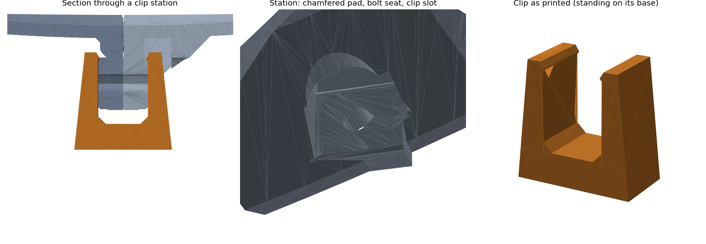

# PETAL 5.0 validation record

Run on the integral-flange candidate. These checks establish numerical geometry and application behavior, not physical qualification.

- Twelve structural configurations: default; optional facets; 260, 600 and 800 mm diameters; explicit two-segment petals; f/D 0.25 and 0.8; 1.6 and 6 mm shells; a 120 mm printer-height constraint; coarse mesh with 30 mm facets.
- Closed consistently oriented meshes, positive volume, one connected solid per part, actual bed/height fit and print-plane placement.
- Sampled final-petal radial insertion against both neighbors, including cross-segment neighbors; inter-segment fit and hub/petal interference. Numerical intersection tolerance 0.02 mm³ accommodates float-precision contact slivers; this is not a dimensional tolerance or exhaustive motion proof.
- Root blind-pilot void and roof, clear central passage, matching seam strips, packed quantities and 6 mm bounding-box separation.
- Twenty-seven actual binary structural STLs reloaded independently with trimesh: watertight, consistent winding, one component, nondegenerate triangles. Export quantization is included.
- Nine feed configurations plus independent hyperbolic reflected-ray/equal-path calculations, frequency sizing, rod cuts, fixed primary focus, phase offsets and automatic rod screening.
- Sampled feed-part interference on six configurations, including 4 and 8 mm rods and a steeper support angle.
- Seven OpenSCAD mesh-snapshot renders match generated part volume within 0.002 relative error and dimensions within 0.05 mm (actual errors substantially smaller).
- Offline DOM checks pass embedded WASM initialization, generation, facets, feed-frequency changes, invalid-state export disabling, reset and generated instructions. WebGL rendering is not exercised by that test.
- A 1200 mm dish with a 1000 mm print volume generates longer flanges with six screw stations per side and a matching 36-screw seam schedule; this is a generation check, not structural qualification of a dish that size.

Default 400 mm result: 6 petals + 1 hub, 2 unique parts; approximately 580.28 cm³ solid CAD volume. Side-oriented petal bounds are approximately 173.8 × 70.0 × 173.1 mm. Shared-bed packing puts three petals on each of two 220 mm beds plus one hub bed, with 8 mm edge margin and 6 mm between part bounds. Brims, supports and machine toolhead clearance remain slicer responsibilities.

A default-petal triangle-normal inspection after the orientation fixes found remaining steep downward surfaces localized to pocket/roof details (largest individual triangle approximately 6.6 mm²); this is not a layer-by-layer support check.

No physical print, slicer toolpath, FEA, wind/creep test, RF gain measurement or outdoor-life qualification is claimed. See TEST_ARTICLE.md for the next gate.

## 5.1 hosting and illustrated exports

The geometry/interface remains revision 10. The app now identifies version 5.1 and a content-derived build ID; the standalone file is `petal-5.1-offline.html`. BUILD.json lists checksums of the complete hosted asset set. The stable old offline URL is only a redirect, so downloaded standalone files should use the versioned name.

PDF fixtures cover the default dish, a 600 mm four-rod prime-focus dish with facets, and a 24 GHz secondary configuration. Tests check actual part filenames/quantities, frequency-dependent rod cuts, text bounds, text visibility after page breaks, and a readable ASSEMBLY.pdf inside the ZIP. Rendered pages were visually reviewed. Views use the generated triangle meshes and are illustrative, not dimensioned drawings; exploded separation is not an assembly motion path. Offline DOM tests also activate the PDF button and verify the downloaded PDF header and filename.

The installer-generated configuration was exercised with the official checksum-verified Caddy binary on ports 56302 and 56303: every hosted asset matched BUILD.json, cache revalidation headers were present, and missing routes returned 404. Installer argument validation and Bash syntax checks passed. Package-manager installation and boot-time systemd execution were not run on this workspace; the script targets the documented systemd distributions and preserves an existing PETAL installation on startup/health-check failure.

## 5.2 staggered rings, mount bores and plate overrides

Interface revision 11 restores half-petal staggering by default for multi-ring dishes. Both sides share the same 2n-sided polygon at each ring boundary; each outer panel meets two inner neighbors. Cross-ring flanges overlap at their common vertex and use no projecting keys. Aligned segmentation remains selectable. Flat-side print orientation and the central Ø30 mm passage remain unchanged.

The central mount offers blind inserts or four Ø4.6 mm full-depth bores with Ø10 mm flat front washer seats. Root inserts remain blind. Hardware quantities and generated instructions reflect the selection.

## Revision 12: flat seats, fastener options, flat hub

Revision 12 makes these changes.

- **Separate root and mount fastener options.**
  - Roots default to blind heat-set inserts, so the reflecting face stays closed. The through-bolt option gives each root a Ø4.5 mm teardrop bore and a Ø9.6 mm recessed flat seat in the front.
  - The hub mount defaults to through bolts and nuts; inserts are an option.
- **Flat seam seats.** The captive hex pockets are gone.
  - Each seam bolt clamps between two Ø10 mm flat seats square to the bolt.
  - The seats are cut through the gussets only, never the shell, and never through a neighbor's bolt pad.
- **Flat hub front by default.** It sits at the petal-root height; a curved front that follows the dish is an option.
- **Ring seams** use the same flange and flat-seat system as the seams between petals.
- **Flat mating faces.** The alignment keys are gone; bolts or clips align the petals.
- **Snap-clip seams (option).** Seams can use printed clips instead of bolts, or offer both at every station.

  

  - With clips, each flange wall is a uniform 5 mm (no pad blocks), so each petal presents one flat face.
  - The clip is a solid trapezoid block with a channel, 10 mm wide along the seam, printed standing on its wide base. It snaps straight up over both walls; the jaws taper from 4 mm at the channel floor to 2.5 mm at the top.
  - Detent: each clip jaw carries a cylindrical bump (R 2.6 mm) straight across its full width, so the clip is a plain extruded profile. It clicks into a cylindrical groove across each wall, 0.1 mm deeper and 0.4 mm wider each side than the clip. Detent depth is a setting (0.3–2 mm, default 1 mm). The wall's bottom edge gets a lead-in chamfer.
  - Where the shell slopes across a seam (ring seams), the walls are made deeper so the full clip and, with both fasteners, the bolt seat stay on the wall.
  - Clip spots tilt to follow the shell along the seam, so the jaw tops sit 0.25 mm under the shell. Across ring seams the shell also slopes across the clip, so one side keeps a small gap there.
  - Two low vertical ridges (1 mm tall) on each wall either side of the clip stop it sliding along the seam or twisting.
  - At each clip station the 45° gusset is cut clean through over the clip and its ridges; the cut end is tilted to 45° or better in print. On radial seams, clips start past the gusset's inner ramp so the wall is full depth at every clip.
  - Where the shell slopes across a clip (toward the rim, and across ring seams), the station sits lower so the jaws clear the shell everywhere.
  - Clip stations are about 40 mm apart (the default dish gets three per seam). Short ring segments get one centered station so the clip stays clear of the corners.
  - Tapered-cantilever estimate of peak jaw strain while a jaw rides over the bump: about 1.0% at 0.3 mm, 1.6% at 0.5 mm and 3.1% at the 1 mm default. Physical testing sets the final detent depth.
  - The fit test includes clips at three squeeze settings.

The tests check, in every structural configuration:
- each seam bore is clear;
- a washer and nut envelope fits on each side;
- the seat has backing;
- in insert mode, the root pilot is clear with a closed roof; in through mode, the bore and seat are clear and the seat floor is solid;
- the hub front is flat, or follows the dish when curved;
- the mount seats are open;
- with clips, each installed clip clears its petal and every other assembled part, including feed parts, and pulling it 1 mm makes the bumps bite the grooves.

The mount check models clips as a conservative ring 26 mm deep behind the dish. With clips, the simple mount clears from −7.5° to 100° instead of −10°.

The upper (male) flange seat faces downward in print. Up to 8 petals it stays within 45°. With more petals it becomes a short overhang about 10 mm across.

Manual plate arrangements preserve copy identity, plate number, X/Y and in-plane yaw. Validation rejects missing/duplicate copies, nonfinite coordinates, out-of-volume placement and less than 6 mm between bounding boxes. Pending edits block exports. Accepted placements reach the STL plates, PLATES.csv, manifest and PDF; model/printer changes reset them. Overrides are session-local.

Validation covers 15 structural configurations, including aligned and staggered two-ring dishes, a three-ring dish and through-bolt hubs. Tests check closed/wound topology, one connected solid per part, print bounds, sampled radial insertion against actual phased neighbors, pilots and roofs, coupons and packing. Separate ring tests check paired cross-ring bore centers and axes, half-petal seam offsets, and three/four-rod registration. Plate tests exercise copy coverage, reassignment, yaw, collision/volume rejection and manifest metadata. Offline UI tests exercise the new controls, apply/reject/reset behavior and PDF download. PDF fixtures include a staggered, faceted 600 mm four-rod dish with the through-hole hub.

These are geometry/software checks. Print a three-panel staggered junction and verify alignment, tool access and side-print overhangs before committing to all rings. No measured strength improvement, slicer toolpath, wind/creep rating or RF performance is established.

Independent trimesh reload of 36 structural binary STLs confirmed watertight, consistently wound, connected positive-volume solids. Mesh cleanup now cancels coincident opposite triangle pairs, collapses sub-resolution connected edges, and refuses unresolved topology rather than exporting a broken seam.

## 5.3 system integration (2026-10-01)

- Full structural, feed, plate and ring regression suite passed, plus five integrated mount configurations: through and blind hub hardware, minimum clip elevation, 600 mm staggered rings with four rods, and a 24 GHz secondary configuration at 90° elevation.
- Mount/dish intersection checks run during generation. Shared affine transforms drive browser, SCAD and PDF assemblies. Stand clearance is calculated at the selected pose and over the permitted elevation interval; it does not replace a continuous collision test or include the stand, cables and metal hardware.
- Canonical mount STL checks passed for manifoldness, interfaces, sampled angular motion and tool access. Exported mount parts and the side-oriented clip had no >45° downward regions or flat ceilings in the triangle-normal printability scan. Slicer toolpaths remain untested.
- Clip tests cover the strain rejection threshold, broad-side print orientation, unique coupon names at tolerance limits, and installed/spare counts. The default detent is 0.3 mm; the user-entered 1.5% strain budget is not a certified material allowable.
- Offline DOM checks exercise mount controls, clip validation, manual plates and exports. Three generated PDF fixtures and ZIP contents pass text/page bounds checks; assembly and part pages were rendered for visual inspection.
- Reproducible CAD snapshots are in `docs/snapshots`: run `node scripts/render-system.mjs` then `python3 scripts/render-system.py`. These are exact generated triangles with stock rod cylinders; fasteners and stand are omitted.
- No physical prints, WebGL rendering test, RF measurement, load rating or warm-creep qualification is claimed. Follow `TEST_ARTICLE.md` before a full assembly.

## Seam levers and M4 seam bolts

- **Seam bolt size.** M3 keeps the revision 12 geometry (Ø3.4 bores, Ø10 seats). M4 cuts Ø4.5 bores with Ø11 seats and, with bolts only, 13 × 11 mm pads. Structural tests check open bores, a clear washer and nut envelope, and flat seat area for M4 with bolts only and with Both.
- **Seam levers.** These use the Both station geometry. The bundled lever, draw bar, keeper and spring meshes come straight from `cad/seam-lever.scad` (`scripts/pack-lever.py`), for M3 and M4 holes. Tests on the 400 mm default and on a 600 mm two-ring staggered M4 dish check three things:
  - every installed set clears the assembled dish;
  - the lever bears on its flange when pushed 0.5 mm toward the wall, and the spring bears on the far flange;
  - TPU springs never share a plate with rigid parts.
- **Ring junctions.** At junctions the set flips to the open side. On the 600 mm two-ring dish, 6 of 48 stations have no room on either side and are scheduled for bolts.
- **Not tested.** Clamp force, cam wear and spring creep are not modeled. Try one set on the seam strips first.

## Unification and lever motion (2026-10-03)

- The open cam tangent no longer penetrates the flange; the M3 and M4 SCAD, print STLs and embedded meshes are regenerated together.
- `tests/lever-motion.test.mjs` checks every installed open lever/bar/keeper/spring against panels and hub on 400 mm and 600 mm dishes, plus the lever at five intermediate cam angles with its pivot following the flange tangent. Cam radii come from SCAD metadata. This is sampled geometry validation, not force, fatigue, physical retention or full insertion-path qualification.
- Mount pilots are 10 mm from the tenon entry face, including the 2 mm inset. Instructions now match the check model: inserts seated 0.5 mm below that entry face. Through-bolt dish instructions distinguish the seven inserts still required by the split mount.
- Assembly/rear/staggered/exploded snapshots were regenerated for the current five-part mount.

## Feed attachment revision 3 — size and focal-ratio envelope

The rim socket pedestal is replaced by a continuous curved saddle with a flat
side-print cheek, 45-degree shoulder and front washer/nut recesses. Socket nut
housings taper into the barrels; radial webs carry the upper sockets into the
puck. Rod axes, 18 mm engagement, pocket/screw datums and rim bolt positions
retain revision 2 dimensions. The accessory manifest and instructions use
revision 3; dish joint interface remains 12.

Run `npm run test:feed-envelope` with numpy, trimesh and manifold3d available to
Python. Its 50-case grid combines dish diameters 260/400/600/800/1200 mm,
f/D 0.25/0.30/0.42/0.60/0.80, and prime-focus/Cassegrain supports. Three additional
cases exercise 4/8 mm rods, clearance extremes, four legs and phase offset.
36 cases build; 17 are explicitly rejected by the existing rod span/rise or
secondary diameter limits. Built cases span focal lengths 65–480 mm and rod
angles 2.29–62.24 degrees. Both staggered ring phases and three/four rod layouts
occur in the grid. These are sampled configurations, not a proof for every
continuous parameter combination.

Independent manifold intersections pass for rim shoe/petal, rear backer/petal,
puck/secondary, and every installed rod against its two fittings. Every exported
assembled solid is watertight, consistently wound and a single connected body.
Real M3 washers/nuts clear the rim recesses; real socket nuts clear their pockets
and sampled side-loading paths. 66 shoe/puck print meshes have at least 116.9 /
1971.2 mm² respectively of flat bed contact. The default shoe increases bed
contact from 60.0 to 204.4 mm². Its material volume rises from 3.76 to 8.10 cm³;
the default prime-focus puck rises from 34.42 to 36.16 cm³. This trades material
for broader roots and bed contact, rather than claiming a mass optimization.

The existing >45-degree overhang scanner still flags circular bores, hardware
pockets and some outer socket faces. At the default prime-focus geometry,
flagged area falls from 371.0 to 288.4 mm² for the shoe and from 809.7 to
648.0 mm² for the puck. Slicer supports/bridging and bore cleanup remain required
as appropriate; neither fitting is certified support-free. Shallow-angle cases
have more puck overhang. No printed load, screw-torque, slip, creep, wind or RF
performance qualification is implied by these checks.

The full regression suite, embedded offline UI, OpenSCAD mesh parity and
illustrated PDF/ZIP validation also pass. `scripts/render-feed-joints.py` renders
actual assembled and print meshes; `scripts/render-accessories.py` renders the
updated complete support assembly.

## Curved seam bearing lands — bolt-only mode

The fixed-height bolt-pad blocks are replaced by full-depth bearing lands clipped
to a swept curved flange envelope. The top overlaps the petal underside; the
bottom stops inside the existing curved flange edge. A 2 mm chamfer joins one
end to the 3 mm wall, while the other retains the existing print-direction ramp.
The small 0.1 mm bottom / 0.4 mm top envelope offsets avoid coincident boolean
faces. Hole centers, flat 5 mm bearing faces, bolt/nut/washer specifications and
interface revision 12 are retained. Clip and lever flange profiles are unchanged.

The structure regression now checks that bearing lands do not protrude through
the reflector face or below the curved flange floor, and that at least 95% of
the outer washer bearing annulus remains supported. Reflector-face checks allow
for the existing tessellation chord error. The 29 structure configurations include
260/400/600/800/1200 mm dishes, f/D 0.25 and 0.8 extremes, M3/M4 bolts, multiple
rings, staggered/aligned joints, faceted rear surfaces, insertion/mating,
connectivity, hardware access and bed packing.

Before/after print scans at default, shallow and deep M4 geometry show no
significant change in overall >45-degree flagged area: approximately 314 mm²
for default/shallow, and 307 → 314 mm² for the deep M4 case. Most flags are
existing near-bed flat bridge surfaces; this is not a support-free claim.
The complete regression suite, offline UI, OpenSCAD parity and illustrated
PDF/ZIP checks pass. Render the actual before/after triangles with
`node scripts/render-seam-pads.mjs && python3 scripts/render-seam-pads.py`.
